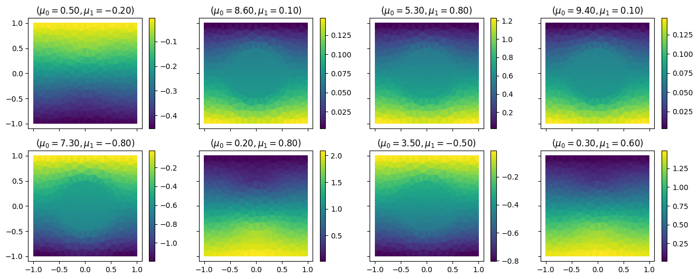
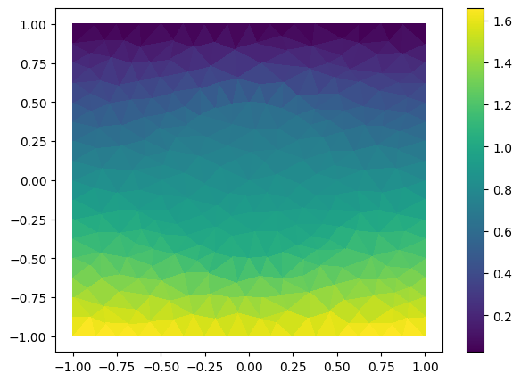

Build and query a simple reduced order model
============================================

In this tutorial we will show the typical workflow for the construcion
of the Reduced Order Model based only on the outputs of the higher-order
model. In detail, we consider here a POD-RBF framework (Proper
Orthogonal Decomposition for dimensionality reduction and Radial Basis
Function for manifold approximation), but the tutorial can be easily
extended to other methods thanks to the modularity nature of **EZyRB**.

We consider a parametric steady heat conduction problem in a
two-dimensional domain :math:`\Omega`. While in this tutorial we are
going to focus on the data-driven approach, the same problem can be
tackled in an intrusive manner (with the Reduced Basis method) using the
`RBniCS <https://gitlab.com/RBniCS/RBniCS>`__, as demonstrated in this
`RBniCS
tutorial <https://gitlab.com/RBniCS/RBniCS/tree/master/tutorials/01_thermal_block>`__.
This book is therefore exhaustively discussed in the book *Certified
reduced basis methods for parametrized partial differential equations*,
J.S. Hesthaven, G. Rozza, B. Stamm, 2016, Springer. An additional
description is available also at
`https://rbnics.gitlab.io/RBniCS-jupyter/tutorial_thermal_block.html <>`__.

Since the good documentation already available for this problem and
since the data-driven methodologies we will take into consideration, we
just summarize the model to allow a better understanding.

The domain is depicted below:

where: - the first parameter :math:`\mu_o` controls the conductivity in
the circular subdomain :math:`\Omega_0`; - the second parameter
:math:`\mu_1` controls the flux over :math:`\Gamma_\text{base}`.

Initial setting
~~~~~~~~~~~~~~~

First of all import the required packages: we need the standard Numpy
and Matplotlib, and some classes from EZyRB. In the EZyRB framework, we
need three main ingredients to construct a reduced order model: - an
initial database where the snapshots are stored; - a reduction method to
reduce the dimensionality of the system, in this tutorial we will use
the proper orthogonal decomposition (POD) method; - an approximation
method to extrapolate the parametric solution for new parameters, in
this tutorial we will use a radial basis function (RBF) interpolation.

.. code:: ipython3

    !pip install ezyrb datasets

.. parsed-literal::

    Requirement already satisfied: ezyrb in /Users/ndemo/miniconda3/envs/pina/lib/python3.12/site-packages (1.3.2)
    Requirement already satisfied: datasets in /Users/ndemo/miniconda3/envs/pina/lib/python3.12/site-packages (4.4.2)
    Requirement already satisfied: future in /Users/ndemo/miniconda3/envs/pina/lib/python3.12/site-packages (from ezyrb) (1.0.0)
    Requirement already satisfied: numpy in /Users/ndemo/miniconda3/envs/pina/lib/python3.12/site-packages (from ezyrb) (2.2.0)
    Requirement already satisfied: scipy in /Users/ndemo/miniconda3/envs/pina/lib/python3.12/site-packages (from ezyrb) (1.14.1)
    Requirement already satisfied: matplotlib in /Users/ndemo/miniconda3/envs/pina/lib/python3.12/site-packages (from ezyrb) (3.10.0)
    Requirement already satisfied: scikit-learn in /Users/ndemo/miniconda3/envs/pina/lib/python3.12/site-packages (from ezyrb) (1.8.0)
    Requirement already satisfied: torch in /Users/ndemo/miniconda3/envs/pina/lib/python3.12/site-packages (from ezyrb) (2.5.1)
    Requirement already satisfied: filelock in /Users/ndemo/miniconda3/envs/pina/lib/python3.12/site-packages (from datasets) (3.16.1)
    Requirement already satisfied: pyarrow>=21.0.0 in /Users/ndemo/miniconda3/envs/pina/lib/python3.12/site-packages (from datasets) (22.0.0)
    Requirement already satisfied: dill<0.4.1,>=0.3.0 in /Users/ndemo/miniconda3/envs/pina/lib/python3.12/site-packages (from datasets) (0.4.0)
    Requirement already satisfied: pandas in /Users/ndemo/miniconda3/envs/pina/lib/python3.12/site-packages (from datasets) (2.2.3)
    Requirement already satisfied: requests>=2.32.2 in /Users/ndemo/miniconda3/envs/pina/lib/python3.12/site-packages (from datasets) (2.32.3)
    Requirement already satisfied: httpx<1.0.0 in /Users/ndemo/miniconda3/envs/pina/lib/python3.12/site-packages (from datasets) (0.28.1)
    Requirement already satisfied: tqdm>=4.66.3 in /Users/ndemo/miniconda3/envs/pina/lib/python3.12/site-packages (from datasets) (4.67.1)
    Requirement already satisfied: xxhash in /Users/ndemo/miniconda3/envs/pina/lib/python3.12/site-packages (from datasets) (3.6.0)
    Requirement already satisfied: multiprocess<0.70.19 in /Users/ndemo/miniconda3/envs/pina/lib/python3.12/site-packages (from datasets) (0.70.18)
    Requirement already satisfied: fsspec<=2025.10.0,>=2023.1.0 in /Users/ndemo/miniconda3/envs/pina/lib/python3.12/site-packages (from fsspec[http]<=2025.10.0,>=2023.1.0->datasets) (2025.10.0)
    Requirement already satisfied: huggingface-hub<2.0,>=0.25.0 in /Users/ndemo/miniconda3/envs/pina/lib/python3.12/site-packages (from datasets) (1.2.3)
    Requirement already satisfied: packaging in /Users/ndemo/miniconda3/envs/pina/lib/python3.12/site-packages (from datasets) (24.2)
    Requirement already satisfied: pyyaml>=5.1 in /Users/ndemo/miniconda3/envs/pina/lib/python3.12/site-packages (from datasets) (6.0.2)
    Requirement already satisfied: aiohttp!=4.0.0a0,!=4.0.0a1 in /Users/ndemo/miniconda3/envs/pina/lib/python3.12/site-packages (from fsspec[http]<=2025.10.0,>=2023.1.0->datasets) (3.11.10)
    Requirement already satisfied: anyio in /Users/ndemo/miniconda3/envs/pina/lib/python3.12/site-packages (from httpx<1.0.0->datasets) (4.8.0)
    Requirement already satisfied: certifi in /Users/ndemo/miniconda3/envs/pina/lib/python3.12/site-packages (from httpx<1.0.0->datasets) (2024.12.14)
    Requirement already satisfied: httpcore==1.* in /Users/ndemo/miniconda3/envs/pina/lib/python3.12/site-packages (from httpx<1.0.0->datasets) (1.0.7)
    Requirement already satisfied: idna in /Users/ndemo/miniconda3/envs/pina/lib/python3.12/site-packages (from httpx<1.0.0->datasets) (3.10)
    Requirement already satisfied: h11<0.15,>=0.13 in /Users/ndemo/miniconda3/envs/pina/lib/python3.12/site-packages (from httpcore==1.*->httpx<1.0.0->datasets) (0.14.0)
    Requirement already satisfied: hf-xet<2.0.0,>=1.2.0 in /Users/ndemo/miniconda3/envs/pina/lib/python3.12/site-packages (from huggingface-hub<2.0,>=0.25.0->datasets) (1.2.0)
    Requirement already satisfied: shellingham in /Users/ndemo/miniconda3/envs/pina/lib/python3.12/site-packages (from huggingface-hub<2.0,>=0.25.0->datasets) (1.5.4)
    Requirement already satisfied: typer-slim in /Users/ndemo/miniconda3/envs/pina/lib/python3.12/site-packages (from huggingface-hub<2.0,>=0.25.0->datasets) (0.20.1)
    Requirement already satisfied: typing-extensions>=3.7.4.3 in /Users/ndemo/miniconda3/envs/pina/lib/python3.12/site-packages (from huggingface-hub<2.0,>=0.25.0->datasets) (4.12.2)
    Requirement already satisfied: charset-normalizer<4,>=2 in /Users/ndemo/miniconda3/envs/pina/lib/python3.12/site-packages (from requests>=2.32.2->datasets) (3.4.0)
    Requirement already satisfied: urllib3<3,>=1.21.1 in /Users/ndemo/miniconda3/envs/pina/lib/python3.12/site-packages (from requests>=2.32.2->datasets) (2.2.3)
    Requirement already satisfied: contourpy>=1.0.1 in /Users/ndemo/miniconda3/envs/pina/lib/python3.12/site-packages (from matplotlib->ezyrb) (1.3.1)
    Requirement already satisfied: cycler>=0.10 in /Users/ndemo/miniconda3/envs/pina/lib/python3.12/site-packages (from matplotlib->ezyrb) (0.12.1)
    Requirement already satisfied: fonttools>=4.22.0 in /Users/ndemo/miniconda3/envs/pina/lib/python3.12/site-packages (from matplotlib->ezyrb) (4.55.3)
    Requirement already satisfied: kiwisolver>=1.3.1 in /Users/ndemo/miniconda3/envs/pina/lib/python3.12/site-packages (from matplotlib->ezyrb) (1.4.7)
    Requirement already satisfied: pillow>=8 in /Users/ndemo/miniconda3/envs/pina/lib/python3.12/site-packages (from matplotlib->ezyrb) (11.0.0)
    Requirement already satisfied: pyparsing>=2.3.1 in /Users/ndemo/miniconda3/envs/pina/lib/python3.12/site-packages (from matplotlib->ezyrb) (3.2.0)
    Requirement already satisfied: python-dateutil>=2.7 in /Users/ndemo/miniconda3/envs/pina/lib/python3.12/site-packages (from matplotlib->ezyrb) (2.9.0.post0)
    Requirement already satisfied: pytz>=2020.1 in /Users/ndemo/miniconda3/envs/pina/lib/python3.12/site-packages (from pandas->datasets) (2025.1)
    Requirement already satisfied: tzdata>=2022.7 in /Users/ndemo/miniconda3/envs/pina/lib/python3.12/site-packages (from pandas->datasets) (2025.1)
    Requirement already satisfied: joblib>=1.3.0 in /Users/ndemo/miniconda3/envs/pina/lib/python3.12/site-packages (from scikit-learn->ezyrb) (1.5.3)
    Requirement already satisfied: threadpoolctl>=3.2.0 in /Users/ndemo/miniconda3/envs/pina/lib/python3.12/site-packages (from scikit-learn->ezyrb) (3.6.0)
    Requirement already satisfied: networkx in /Users/ndemo/miniconda3/envs/pina/lib/python3.12/site-packages (from torch->ezyrb) (3.4.2)
    Requirement already satisfied: jinja2 in /Users/ndemo/miniconda3/envs/pina/lib/python3.12/site-packages (from torch->ezyrb) (3.1.4)
    Requirement already satisfied: setuptools in /Users/ndemo/miniconda3/envs/pina/lib/python3.12/site-packages (from torch->ezyrb) (75.6.0)
    Requirement already satisfied: sympy==1.13.1 in /Users/ndemo/miniconda3/envs/pina/lib/python3.12/site-packages (from torch->ezyrb) (1.13.1)
    Requirement already satisfied: mpmath<1.4,>=1.1.0 in /Users/ndemo/miniconda3/envs/pina/lib/python3.12/site-packages (from sympy==1.13.1->torch->ezyrb) (1.3.0)
    Requirement already satisfied: aiohappyeyeballs>=2.3.0 in /Users/ndemo/miniconda3/envs/pina/lib/python3.12/site-packages (from aiohttp!=4.0.0a0,!=4.0.0a1->fsspec[http]<=2025.10.0,>=2023.1.0->datasets) (2.4.4)
    Requirement already satisfied: aiosignal>=1.1.2 in /Users/ndemo/miniconda3/envs/pina/lib/python3.12/site-packages (from aiohttp!=4.0.0a0,!=4.0.0a1->fsspec[http]<=2025.10.0,>=2023.1.0->datasets) (1.3.2)
    Requirement already satisfied: attrs>=17.3.0 in /Users/ndemo/miniconda3/envs/pina/lib/python3.12/site-packages (from aiohttp!=4.0.0a0,!=4.0.0a1->fsspec[http]<=2025.10.0,>=2023.1.0->datasets) (24.3.0)
    Requirement already satisfied: frozenlist>=1.1.1 in /Users/ndemo/miniconda3/envs/pina/lib/python3.12/site-packages (from aiohttp!=4.0.0a0,!=4.0.0a1->fsspec[http]<=2025.10.0,>=2023.1.0->datasets) (1.5.0)
    Requirement already satisfied: multidict<7.0,>=4.5 in /Users/ndemo/miniconda3/envs/pina/lib/python3.12/site-packages (from aiohttp!=4.0.0a0,!=4.0.0a1->fsspec[http]<=2025.10.0,>=2023.1.0->datasets) (6.1.0)
    Requirement already satisfied: propcache>=0.2.0 in /Users/ndemo/miniconda3/envs/pina/lib/python3.12/site-packages (from aiohttp!=4.0.0a0,!=4.0.0a1->fsspec[http]<=2025.10.0,>=2023.1.0->datasets) (0.2.1)
    Requirement already satisfied: yarl<2.0,>=1.17.0 in /Users/ndemo/miniconda3/envs/pina/lib/python3.12/site-packages (from aiohttp!=4.0.0a0,!=4.0.0a1->fsspec[http]<=2025.10.0,>=2023.1.0->datasets) (1.18.3)
    Requirement already satisfied: six>=1.5 in /Users/ndemo/miniconda3/envs/pina/lib/python3.12/site-packages (from python-dateutil>=2.7->matplotlib->ezyrb) (1.17.0)
    Requirement already satisfied: sniffio>=1.1 in /Users/ndemo/miniconda3/envs/pina/lib/python3.12/site-packages (from anyio->httpx<1.0.0->datasets) (1.3.1)
    Requirement already satisfied: MarkupSafe>=2.0 in /Users/ndemo/miniconda3/envs/pina/lib/python3.12/site-packages (from jinja2->torch->ezyrb) (3.0.2)
    Requirement already satisfied: click>=8.0.0 in /Users/ndemo/miniconda3/envs/pina/lib/python3.12/site-packages (from typer-slim->huggingface-hub<2.0,>=0.25.0->datasets) (8.3.1)
    
    [notice] A new release of pip is available: 24.3.1 -> 25.3
    [notice] To update, run: pip install --upgrade pip

.. code:: ipython3

    import numpy as np
    import matplotlib.tri as mtri
    import matplotlib.pyplot as plt
    from ezyrb import POD, RBF, Database
    from ezyrb import ReducedOrderModel as ROM
    %matplotlib inline

Offline phase
-------------

In the *offline* phase, we need some samples of the parametric
high-fidelity model. In this case, we extract 8 snapshots from the
numerical model implemented in **FEniCS**, and we import them and the
related parameters.

.. code:: ipython3

    from datasets import load_dataset
    data_path = "kshitij-pandey/termal_dataset"
    snapshots_hf = load_dataset(data_path, "snapshots", split="train")
    param_hf = load_dataset(data_path, "params", split="train")
    triangles_hf    = load_dataset(data_path, "triangles", split="train")
    coords_hf = load_dataset(data_path, "coords",     split="train")
    
    
    # convert the dict files into numpy
    
    import pandas as pd
    
    def hf_to_numpy(ds):
        return ds.to_pandas().to_numpy()
    
    
    snapshots = hf_to_numpy(snapshots_hf)
    param = hf_to_numpy(param_hf)
    triangles = hf_to_numpy(triangles_hf)
    coords = hf_to_numpy(coords_hf)
    print(snapshots.shape, param.shape)

.. parsed-literal::

    (8, 304) (8, 2)

Moreover, to visualize the solution (both the higher-order one and the
reduced one), we import also the mesh information to be able to create
the triangulation. We underline this additional step is related only to
plotting purpose, and not mandatory for the reduced space generation.

.. code:: ipython3

    x, y  = coords
    from matplotlib.tri import Triangulation
    triang = Triangulation(x, y, triangles)
    triang = triang

For the sake of clarity the snapshots are plotted.

.. code:: ipython3

    fig, ax = plt.subplots(nrows=2, ncols=4, figsize=(16, 6), sharey=True, sharex=True)
    ax = ax.flatten()
    for i in range(8):
        ax[i].triplot(triang, 'b-', lw=0.1)
        cm = ax[i].tripcolor(triang, snapshots[i])
        fig.colorbar(cm, ax=ax[i])
        ax[i].set_title('($\mu_0={:5.2f}, \mu_1={:5.2f})$'.format(*param[i]))

First of all, we create a ``Database`` object from the parameters and
the snapshots.

.. code:: ipython3

    db = Database(param, snapshots)

Then we need a reduction object. In this case we use the proper
orthogonal decomposition so we create a ``POD`` object. We use here all
the default parameters, but for the complete list of available arguments
we refer to original documentation of
`POD <https://mathlab.github.io/EZyRB/pod.html>`__ class.

.. code:: ipython3

    pod = POD('svd')

Then we instantiate the ``RBF`` class for interpolating the solution
manifold. Also in this case,
`RBF <https://mathlab.github.io/EZyRB/rbf.html>`__ documentation is the
perfect starting point to explore such class.

.. code:: ipython3

    rbf = RBF()

Few lines of code and our reduced model is created! To complete
everything, we create the ``ReducedOrderModel`` (aliased to ``ROM`` in
this tutorial) object by passing the already created objects. For
clarity, we puntualize that we need to pass the **instances** and not
the classes. Simply changing such line (with different objects) allows
to test different frameworks in a very modular way. The ``fit()``
function computes the reduced model, meaning that the original snapshots
in the database are projected onto the POD space and the RBF
interpolator is created.

.. code:: ipython3

    rom = ROM(db, pod, rbf)
    rom.fit();

Online phase
------------

In the *online* phase we can query our model in order to predict the
solution for a new parameter :math:`\mu_\text{new}` that is not in the
training set. We just need to pass the new parameters as input of the
``predict()`` function.

.. code:: ipython3

    new_mu = [8,   1]
    pred_sol = rom.predict(new_mu)

We can so plot the predicted solution for a fixed parameter…

.. code:: ipython3

    plt.figure(figsize=(7, 5))
    plt.triplot(triang, 'b-', lw=0.1)
    plt.tripcolor(triang, *pred_sol)
    plt.colorbar();

Error Approximation & Improvement
---------------------------------

At the moment, we used a database which is composed by 8 files. we would
have an idea of the approximation accuracy we are able to reach with
these high-fidelity solutions. Using the *leave-one-out* strategy, an
error is computed for each parametric point in our database and these
values are returned as array.

.. code:: ipython3

    for pt, error in zip(rom.database.parameters_matrix, rom.loo_error()):
        print(pt, error)

.. parsed-literal::

    [ 0.5 -0.2] 0.3830555986412087
    [8.6 0.1] 0.5972596749801533
    [5.3 0.8] 0.8082744257222089
    [9.4 0.1] 0.4105803285232253
    [ 7.3 -0.8] 0.5505863544054451
    [0.2 0.8] 0.07567485849711765
    [ 3.5 -0.5] 0.66949247698686
    [0.3 0.6] 0.06478619218562698

Moreover, we can use the information about the errors to locate the
parametric points where we have to compute the new high-fidelity
solutions and add these to the database in order to optimally improve
the accuracy.

.. code:: ipython3

    rom.optimal_mu()

.. parsed-literal::

    array([[ 5.2487694 , -0.06339911]])

These function can be used to achieve the wanted (estimated) accuracy.
