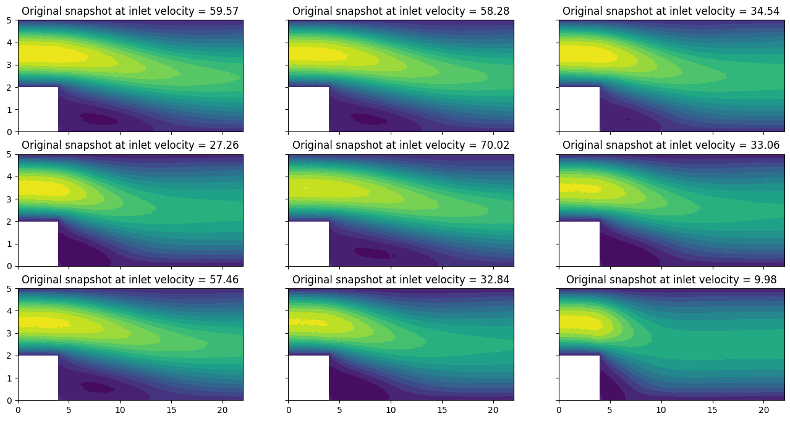
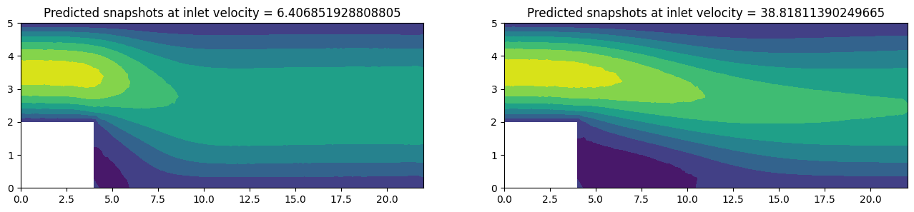

Test several frameworks at once
================================

In this tutorial, we will explain step by step how to use the **EZyRB**
library to test different techniques for building the reduced order
model. We will compare different methods of dimensionality reduction,
interpolation and accuracy assessment.

We consider here a computational fluid dynamics problem described by the
(incompressible) Navier Stokes equations. We will be using the **Navier
Stokes Dataset** that contains the output data from a full order flow
simulation and can be found on **Hugging Face Datasets**

The package can be installed using ``python -m pip install datasets``,
but for a detailed description about installation and usage we refer to
original `Github page <https://huggingface.co/docs/datasets/index>`__.

First of all, we just import the package and instantiate the dataset
object.

.. code:: ipython3

    !pip install datasets ezyrb

.. parsed-literal::

    Requirement already satisfied: datasets in /Users/ndemo/miniconda3/envs/pina/lib/python3.12/site-packages (4.4.2)
    Requirement already satisfied: ezyrb in /Users/ndemo/miniconda3/envs/pina/lib/python3.12/site-packages (1.3.2)
    Requirement already satisfied: filelock in /Users/ndemo/miniconda3/envs/pina/lib/python3.12/site-packages (from datasets) (3.16.1)
    Requirement already satisfied: numpy>=1.17 in /Users/ndemo/miniconda3/envs/pina/lib/python3.12/site-packages (from datasets) (2.2.0)
    Requirement already satisfied: pyarrow>=21.0.0 in /Users/ndemo/miniconda3/envs/pina/lib/python3.12/site-packages (from datasets) (22.0.0)
    Requirement already satisfied: dill<0.4.1,>=0.3.0 in /Users/ndemo/miniconda3/envs/pina/lib/python3.12/site-packages (from datasets) (0.4.0)
    Requirement already satisfied: pandas in /Users/ndemo/miniconda3/envs/pina/lib/python3.12/site-packages (from datasets) (2.2.3)
    Requirement already satisfied: requests>=2.32.2 in /Users/ndemo/miniconda3/envs/pina/lib/python3.12/site-packages (from datasets) (2.32.3)
    Requirement already satisfied: httpx<1.0.0 in /Users/ndemo/miniconda3/envs/pina/lib/python3.12/site-packages (from datasets) (0.28.1)
    Requirement already satisfied: tqdm>=4.66.3 in /Users/ndemo/miniconda3/envs/pina/lib/python3.12/site-packages (from datasets) (4.67.1)
    Requirement already satisfied: xxhash in /Users/ndemo/miniconda3/envs/pina/lib/python3.12/site-packages (from datasets) (3.6.0)
    Requirement already satisfied: multiprocess<0.70.19 in /Users/ndemo/miniconda3/envs/pina/lib/python3.12/site-packages (from datasets) (0.70.18)
    Requirement already satisfied: fsspec<=2025.10.0,>=2023.1.0 in /Users/ndemo/miniconda3/envs/pina/lib/python3.12/site-packages (from fsspec[http]<=2025.10.0,>=2023.1.0->datasets) (2025.10.0)
    Requirement already satisfied: huggingface-hub<2.0,>=0.25.0 in /Users/ndemo/miniconda3/envs/pina/lib/python3.12/site-packages (from datasets) (1.2.3)
    Requirement already satisfied: packaging in /Users/ndemo/miniconda3/envs/pina/lib/python3.12/site-packages (from datasets) (24.2)
    Requirement already satisfied: pyyaml>=5.1 in /Users/ndemo/miniconda3/envs/pina/lib/python3.12/site-packages (from datasets) (6.0.2)
    Requirement already satisfied: future in /Users/ndemo/miniconda3/envs/pina/lib/python3.12/site-packages (from ezyrb) (1.0.0)
    Requirement already satisfied: scipy in /Users/ndemo/miniconda3/envs/pina/lib/python3.12/site-packages (from ezyrb) (1.14.1)
    Requirement already satisfied: matplotlib in /Users/ndemo/miniconda3/envs/pina/lib/python3.12/site-packages (from ezyrb) (3.10.0)
    Requirement already satisfied: scikit-learn in /Users/ndemo/miniconda3/envs/pina/lib/python3.12/site-packages (from ezyrb) (1.8.0)
    Requirement already satisfied: torch in /Users/ndemo/miniconda3/envs/pina/lib/python3.12/site-packages (from ezyrb) (2.5.1)
    Requirement already satisfied: aiohttp!=4.0.0a0,!=4.0.0a1 in /Users/ndemo/miniconda3/envs/pina/lib/python3.12/site-packages (from fsspec[http]<=2025.10.0,>=2023.1.0->datasets) (3.11.10)
    Requirement already satisfied: anyio in /Users/ndemo/miniconda3/envs/pina/lib/python3.12/site-packages (from httpx<1.0.0->datasets) (4.8.0)
    Requirement already satisfied: certifi in /Users/ndemo/miniconda3/envs/pina/lib/python3.12/site-packages (from httpx<1.0.0->datasets) (2024.12.14)
    Requirement already satisfied: httpcore==1.* in /Users/ndemo/miniconda3/envs/pina/lib/python3.12/site-packages (from httpx<1.0.0->datasets) (1.0.7)
    Requirement already satisfied: idna in /Users/ndemo/miniconda3/envs/pina/lib/python3.12/site-packages (from httpx<1.0.0->datasets) (3.10)
    Requirement already satisfied: h11<0.15,>=0.13 in /Users/ndemo/miniconda3/envs/pina/lib/python3.12/site-packages (from httpcore==1.*->httpx<1.0.0->datasets) (0.14.0)
    Requirement already satisfied: hf-xet<2.0.0,>=1.2.0 in /Users/ndemo/miniconda3/envs/pina/lib/python3.12/site-packages (from huggingface-hub<2.0,>=0.25.0->datasets) (1.2.0)
    Requirement already satisfied: shellingham in /Users/ndemo/miniconda3/envs/pina/lib/python3.12/site-packages (from huggingface-hub<2.0,>=0.25.0->datasets) (1.5.4)
    Requirement already satisfied: typer-slim in /Users/ndemo/miniconda3/envs/pina/lib/python3.12/site-packages (from huggingface-hub<2.0,>=0.25.0->datasets) (0.20.1)
    Requirement already satisfied: typing-extensions>=3.7.4.3 in /Users/ndemo/miniconda3/envs/pina/lib/python3.12/site-packages (from huggingface-hub<2.0,>=0.25.0->datasets) (4.12.2)
    Requirement already satisfied: charset-normalizer<4,>=2 in /Users/ndemo/miniconda3/envs/pina/lib/python3.12/site-packages (from requests>=2.32.2->datasets) (3.4.0)
    Requirement already satisfied: urllib3<3,>=1.21.1 in /Users/ndemo/miniconda3/envs/pina/lib/python3.12/site-packages (from requests>=2.32.2->datasets) (2.2.3)
    Requirement already satisfied: contourpy>=1.0.1 in /Users/ndemo/miniconda3/envs/pina/lib/python3.12/site-packages (from matplotlib->ezyrb) (1.3.1)
    Requirement already satisfied: cycler>=0.10 in /Users/ndemo/miniconda3/envs/pina/lib/python3.12/site-packages (from matplotlib->ezyrb) (0.12.1)
    Requirement already satisfied: fonttools>=4.22.0 in /Users/ndemo/miniconda3/envs/pina/lib/python3.12/site-packages (from matplotlib->ezyrb) (4.55.3)
    Requirement already satisfied: kiwisolver>=1.3.1 in /Users/ndemo/miniconda3/envs/pina/lib/python3.12/site-packages (from matplotlib->ezyrb) (1.4.7)
    Requirement already satisfied: pillow>=8 in /Users/ndemo/miniconda3/envs/pina/lib/python3.12/site-packages (from matplotlib->ezyrb) (11.0.0)
    Requirement already satisfied: pyparsing>=2.3.1 in /Users/ndemo/miniconda3/envs/pina/lib/python3.12/site-packages (from matplotlib->ezyrb) (3.2.0)
    Requirement already satisfied: python-dateutil>=2.7 in /Users/ndemo/miniconda3/envs/pina/lib/python3.12/site-packages (from matplotlib->ezyrb) (2.9.0.post0)
    Requirement already satisfied: pytz>=2020.1 in /Users/ndemo/miniconda3/envs/pina/lib/python3.12/site-packages (from pandas->datasets) (2025.1)
    Requirement already satisfied: tzdata>=2022.7 in /Users/ndemo/miniconda3/envs/pina/lib/python3.12/site-packages (from pandas->datasets) (2025.1)
    Requirement already satisfied: joblib>=1.3.0 in /Users/ndemo/miniconda3/envs/pina/lib/python3.12/site-packages (from scikit-learn->ezyrb) (1.5.3)
    Requirement already satisfied: threadpoolctl>=3.2.0 in /Users/ndemo/miniconda3/envs/pina/lib/python3.12/site-packages (from scikit-learn->ezyrb) (3.6.0)
    Requirement already satisfied: networkx in /Users/ndemo/miniconda3/envs/pina/lib/python3.12/site-packages (from torch->ezyrb) (3.4.2)
    Requirement already satisfied: jinja2 in /Users/ndemo/miniconda3/envs/pina/lib/python3.12/site-packages (from torch->ezyrb) (3.1.4)
    Requirement already satisfied: setuptools in /Users/ndemo/miniconda3/envs/pina/lib/python3.12/site-packages (from torch->ezyrb) (75.6.0)
    Requirement already satisfied: sympy==1.13.1 in /Users/ndemo/miniconda3/envs/pina/lib/python3.12/site-packages (from torch->ezyrb) (1.13.1)
    Requirement already satisfied: mpmath<1.4,>=1.1.0 in /Users/ndemo/miniconda3/envs/pina/lib/python3.12/site-packages (from sympy==1.13.1->torch->ezyrb) (1.3.0)
    Requirement already satisfied: aiohappyeyeballs>=2.3.0 in /Users/ndemo/miniconda3/envs/pina/lib/python3.12/site-packages (from aiohttp!=4.0.0a0,!=4.0.0a1->fsspec[http]<=2025.10.0,>=2023.1.0->datasets) (2.4.4)
    Requirement already satisfied: aiosignal>=1.1.2 in /Users/ndemo/miniconda3/envs/pina/lib/python3.12/site-packages (from aiohttp!=4.0.0a0,!=4.0.0a1->fsspec[http]<=2025.10.0,>=2023.1.0->datasets) (1.3.2)
    Requirement already satisfied: attrs>=17.3.0 in /Users/ndemo/miniconda3/envs/pina/lib/python3.12/site-packages (from aiohttp!=4.0.0a0,!=4.0.0a1->fsspec[http]<=2025.10.0,>=2023.1.0->datasets) (24.3.0)
    Requirement already satisfied: frozenlist>=1.1.1 in /Users/ndemo/miniconda3/envs/pina/lib/python3.12/site-packages (from aiohttp!=4.0.0a0,!=4.0.0a1->fsspec[http]<=2025.10.0,>=2023.1.0->datasets) (1.5.0)
    Requirement already satisfied: multidict<7.0,>=4.5 in /Users/ndemo/miniconda3/envs/pina/lib/python3.12/site-packages (from aiohttp!=4.0.0a0,!=4.0.0a1->fsspec[http]<=2025.10.0,>=2023.1.0->datasets) (6.1.0)
    Requirement already satisfied: propcache>=0.2.0 in /Users/ndemo/miniconda3/envs/pina/lib/python3.12/site-packages (from aiohttp!=4.0.0a0,!=4.0.0a1->fsspec[http]<=2025.10.0,>=2023.1.0->datasets) (0.2.1)
    Requirement already satisfied: yarl<2.0,>=1.17.0 in /Users/ndemo/miniconda3/envs/pina/lib/python3.12/site-packages (from aiohttp!=4.0.0a0,!=4.0.0a1->fsspec[http]<=2025.10.0,>=2023.1.0->datasets) (1.18.3)
    Requirement already satisfied: six>=1.5 in /Users/ndemo/miniconda3/envs/pina/lib/python3.12/site-packages (from python-dateutil>=2.7->matplotlib->ezyrb) (1.17.0)
    Requirement already satisfied: sniffio>=1.1 in /Users/ndemo/miniconda3/envs/pina/lib/python3.12/site-packages (from anyio->httpx<1.0.0->datasets) (1.3.1)
    Requirement already satisfied: MarkupSafe>=2.0 in /Users/ndemo/miniconda3/envs/pina/lib/python3.12/site-packages (from jinja2->torch->ezyrb) (3.0.2)
    Requirement already satisfied: click>=8.0.0 in /Users/ndemo/miniconda3/envs/pina/lib/python3.12/site-packages (from typer-slim->huggingface-hub<2.0,>=0.25.0->datasets) (8.3.1)
    
    [notice] A new release of pip is available: 24.3.1 -> 25.3
    [notice] To update, run: pip install --upgrade pip

.. code:: ipython3

    from datasets import load_dataset
    data_path = "kshitij-pandey/navier_stokes_datasets"
    snapshots_hf = load_dataset(data_path, "snapshots_split", split="train")
    param_hf = load_dataset(data_path, "params", split="train")
    triangles_hf    = load_dataset(data_path, "triangles", split="train")
    coords_hf = load_dataset(data_path, "coords", split="train")
    import numpy as np
    snapshots = {name: np.array(snapshots_hf[name]) for name in ['vx', 'vy', 'mag(v)', 'p']}
    # convert the dict files into numpy
    
    import pandas as pd
    
    def hf_to_numpy(ds):
        return ds.to_pandas().to_numpy()
    
    
    params = hf_to_numpy(param_hf)
    triangles = hf_to_numpy(triangles_hf)
    coords = hf_to_numpy(coords_hf)

The ``NavierStokesDataset()`` class contains the attribute: -
``snapshots``: the matrices of snapshots stored by row (one matrix for
any output field) - ``params``: the matrix of corresponding parameters -
``pts_coordinates``: the coordinates of all nodes of the discretize
space - ``faces``: the actual topology of the discretize space -
``triang``: the triangulation, useful especially for rendering purposes.

In the details, ``snapshots`` is a dictionary with the following output
of interest: - **vx:** velocity in the X-direction. - **vy:** velocity
in the Y-direction. - **mag(v):** velocity magnitude. - **p:** pressure
value.

In total, the dataset contains 500 parametric configurations in a space
of 1639 degrees of freedom. In this case, we have just one parameter,
which is the velocity (along :math:`x`) we impose at the inlet.

.. code:: ipython3

    for name in ['vx', 'vy', 'p', 'mag(v)']:
         print('Shape of {:7s} snapshots matrix: {}'.format(name, snapshots[name].shape))
    
    print('Shape of parameters matrix: {}'.format(params.shape))

.. parsed-literal::

    Shape of vx      snapshots matrix: (500, 1639)
    Shape of vy      snapshots matrix: (500, 1639)
    Shape of p       snapshots matrix: (500, 1639)
    Shape of mag(v)  snapshots matrix: (500, 1639)
    Shape of parameters matrix: (500, 1)

Initial setting
~~~~~~~~~~~~~~~

First of all, we import the required packages.

From ``EZyRB`` we need: 1. The ``ROM`` class, which performs the model
order reduction process. 2. A module such as ``Database``, where the
matrices of snapshots and parameters are stored. 3. A dimensionality
reduction method such as Proper Orthogonal Decomposition ``POD`` or
Auto-Encoder network ``AE``. 4. An interpolation method to obtain an
approximation for the parametric solution for a new set of parameters
such as the Radial Basis Function ``RBF``, Gaussian Process Regression
``GPR``, K-Neighbors Regressor ``KNeighborsRegressor``, Radius Neighbors
Regressor ``RadiusNeighborsRegressor`` or Multidimensional Linear
Interpolator ``Linear``.

We also need to import: \* ``numpy:`` to handle arrays and matrices we
will be working with. \* ``torch:`` to enable the usage of Neural
Networks \* ``matplotlib.pyplot:`` to handle the plotting environment.
\* ``matplotlib.tri:`` for plotting of the triangular grid.

.. code:: ipython3

    # Database module
    from ezyrb import Database
    
    # Dimensionality reduction methods
    from ezyrb import POD, AE
    
    # Approximation/interpolation methods
    from ezyrb import RBF, GPR, KNeighborsRegressor, RadiusNeighborsRegressor, Linear, ANN
    
    # Model order reduction calss
    from ezyrb import ReducedOrderModel as ROM
    import torch
    import torch.nn as nn
    
    import matplotlib.tri as mtri
    import matplotlib.pyplot as plt
    
    import warnings
    warnings.filterwarnings("ignore", message="Ill-conditioned matrix ")
    %matplotlib inline

Before starting with the reduced order model, we visualize some of the
snapshots in our dataset.

.. code:: ipython3

    x, y  = coords
    from matplotlib.tri import Triangulation
    triang = Triangulation(x, y, triangles)
    fig, ax = plt.subplots(nrows=3, ncols=3, figsize=(16, 8), sharey=True, sharex=True)
    ax = ax.flatten()
    for i in range(9):
        ax[i].tricontourf(triang, snapshots['vx'][i], levels=16)
        ax[i].set_title('Original snapshot at inlet velocity = {}'.format(*params[i].round(2)))

In this step, we perform the model order reduction to obtain a reduced
space from the full order space. We refer to `Tutorial
1 <https://github.com/mathLab/EZyRB/blob/master/tutorials/tutorial-1.ipynb>`__
for the description of the basic workflow, here we just quickly describe
the steps implemented in the next cell.

We start by passing the matrices of the parameters and snapshots to the
``Database()`` class. It must be said that at this time we create the
ROM for the ``vx`` field. We also instantiate the ``POD`` and ``RBF``
object to have a benchmark ROM.

.. code:: ipython3

    db = Database(params, snapshots['vx'])
    rom = ROM(db, POD(), RBF())
    rom.fit();

Three lines for a data-driven reduced order model, not bad!

Just to have a visual check that everything is going well, we plot the
approximation for new parameters in the range :math:`[1, 80]`.

.. code:: ipython3

    new_params = np.random.uniform(size=(2))*79.+1.
    
    fig, ax = plt.subplots(nrows=1, ncols=2, figsize=(16, 3))
    for i, param in enumerate(new_params):
        ax[i].tricontourf(triang, *rom.predict([param]))
        ax[i].set_title('Predicted snapshots at inlet velocity = {}'.format(param))

We are now calculating the approximation error to see how close is our
reduced solution to the full-order solution/simulation using the
**k-fold Cross-Validation** strategy by passing the number of splits to
the ``ReducedOrderModel.kfold_cv_error(n_splits)`` method, which
operates as follows:

1. Split the dataset (parameters/snapshots) into :math:`k`-number of
   groups/folds.
2. Use :math:`k-1` groups to calculate the reduced space and leave one
   group for testing.
3. Use the approximation/interpolation method to predict each snapshot
   in the testing group.
4. Calculate the error for each snapshot in the testing group by taking
   the difference between the predicted and the original snapshot.
5. Average the errors for predicting snapshots of the testing
   group/fold.
6. Repeat this procedure using different groups for testing and the
   remaining :math:`k-1` groups to calculate the reduced space.
7. In the end, we will have :math:`k`-number errors for predicting each
   group/fold that we can average them to have one value for the error.

.. code:: ipython3

    errors = rom.kfold_cv_error(n_splits = 5)
    print('Average error for each fold:')
    for e in errors:
        print('  ',e)
    print('\nAverage error = {}'.format(errors.mean()))

.. parsed-literal::

    Average error for each fold:
       4.945136635258633e-07
       9.860761253488605e-07
       3.894778057436833e-06
       5.303642035538002e-06
       1.2984622088905908e-07
    
    Average error = 2.1617712205477237e-06

Another strategy for calculating the approximation error is called
**leave-one-out** by using the ``ReducedOrderModel.loo_error()`` method,
which is similar to setting the number of folds equal to the number of
snapshots (eg. in this case setting ``n_splits`` = 500) and it operates
as follows: 1. Combine all the snapshots except one. 2. Calculate the
reduced space. 3. Use the approximation/interpolation method to predict
the removed snapshot. 4. Calculate the error by taking the difference
between the predicted snapshot and the original removed one. 5. The
error vector is obtained by repeating this procedure for each snapshot
in the database.

It is worth mentioning that it consumes more time because we have 500
snapshots and the algorithm will perform space order reduction and
calculate the approximation error 500 times. For this reason, we
commented the next line of code, in order to limit the computational
effort needed to run this tutorial. Uncomment it only if you are a
really brave person!

.. code:: ipython3

    # errors = rom.loo_error()

Comparison between different methods
~~~~~~~~~~~~~~~~~~~~~~~~~~~~~~~~~~~~

One of the advantages of the data-driven reduced order modeling is the
modular nature of the method. Practically speaking, we need - a method
for reducing the dimensionality of input snapshots; - a method for
approximate the solution manifold;

allowing in principle a large variety of combinations.

The list of implemented **reduction methods** in EZyRB contains: -
``POD``: *proper orthogonal decomposition* - ``AE``: *autoencoder*

while the list of implemented **approximation methods** contains: -
``RBF``: *radial basis function interpolation* - ``GPR``: *gaussian
process regression* - ``KNeighborsRegressor``: *k-neighbors regression*
- ``RadiusNeighborsRegressor``: *radius neighbors regression* -
``Linear``: *multidimensional linear interpolation*

Moreover, new state-of-the-art methods will arrive, so we invite you to
read the `documentation <https://mathlab.github.io/EZyRB/>`__ for the
complete list of all the possibilities!

In the next cell, we create two dictionaries with the objects, such that
we can easily test everything with simple ``for`` cycles. **WARNING**
since several methods require the solution of an optimization problem
(eg. GPR, ANN, AE), the cell may require some minutes to be run.

.. code:: ipython3

    reductions = {
        'POD': POD('svd',rank=10),
        'AE': AE([200, 100, 10], [10, 100, 200], nn.Tanh(), nn.Tanh(), 10, frequency_print=-10),
    }
    
    approximations = {
    #    'Linear': Linear(),
        'RBF': RBF(),
        'GPR': GPR(),
        'KNeighbors': KNeighborsRegressor(),
        'RadiusNeighbors':  RadiusNeighborsRegressor(),
        'ANN': ANN([20, 20], nn.Tanh(), 10, frequency_print=-10),
    }
    
    s = '\n\n{:10s}'.format('')
    for name in approximations:
        s += ' {:>15s}'.format(name)
    s += '\n'
    
    for redname, redclass in reductions.items():
        row = '{:10s}'.format(redname)
        for approxname, approxclass in approximations.items():
            rom = ROM(db, redclass, approxclass)
            print(f"Processing {redname}-{approxname}")
            rom.fit()
            row += ' {:15e}'.format(rom.kfold_cv_error(n_splits=5).mean())
        
        s += f'{row}\n'
    
    print(s)

.. parsed-literal::

    Processing POD-RBF
    Processing POD-GPR
    Processing POD-KNeighbors
    Processing POD-RadiusNeighbors
    Processing POD-ANN
    [epoch      1]	9.546327e+04
    [epoch     10]	9.538811e+04
    [epoch      1]	9.522560e+04
    [epoch     10]	9.515077e+04
    [epoch      1]	9.766096e+04
    [epoch     10]	9.758415e+04
    [epoch      1]	9.519630e+04
    [epoch     10]	9.512106e+04
    [epoch      1]	9.567339e+04
    [epoch     10]	9.559758e+04
    [epoch      1]	9.314678e+04
    [epoch     10]	9.307255e+04
    Processing AE-RBF
    [epoch      1]	5.823453e+02
    [epoch     10]	5.556604e+02
    [epoch      1]	5.812169e+02
    [epoch     10]	8.230733e+01
    [epoch      1]	5.957941e+02
    [epoch     10]	9.019125e+01
    [epoch      1]	5.806075e+02
    [epoch     10]	6.687416e+01
    [epoch      1]	5.835210e+02
    [epoch     10]	7.294649e+01
    [epoch      1]	5.700542e+02
    [epoch     10]	7.343178e+01
    Processing AE-GPR
    [epoch      1]	5.834352e+02
    [epoch     10]	7.699603e+01
    [epoch      1]	5.847290e+02
    [epoch     10]	1.470968e+02
    [epoch      1]	5.948226e+02
    [epoch     10]	7.184375e+01
    [epoch      1]	5.802390e+02
    [epoch     10]	7.155777e+01
    [epoch      1]	5.853676e+02
    [epoch     10]	1.150479e+02
    [epoch      1]	5.690804e+02
    [epoch     10]	6.931157e+01
    Processing AE-KNeighbors
    [epoch      1]	5.819167e+02
    [epoch     10]	6.814513e+01
    [epoch      1]	5.820450e+02
    [epoch     10]	9.533990e+01
    [epoch      1]	5.980317e+02
    [epoch     10]	1.218049e+02
    [epoch      1]	5.849615e+02
    [epoch     10]	9.724957e+01
    [epoch      1]	5.848712e+02
    [epoch     10]	1.151645e+02
    [epoch      1]	5.692266e+02
    [epoch     10]	7.778555e+01
    Processing AE-RadiusNeighbors
    [epoch      1]	5.845089e+02
    [epoch     10]	1.057290e+02
    [epoch      1]	5.836143e+02
    [epoch     10]	8.220594e+01
    [epoch      1]	5.969666e+02
    [epoch     10]	8.701730e+01
    [epoch      1]	5.823361e+02
    [epoch     10]	9.751357e+01
    [epoch      1]	5.850589e+02
    [epoch     10]	9.528002e+01
    [epoch      1]	5.675153e+02
    [epoch     10]	6.384907e+01
    Processing AE-ANN
    [epoch      1]	5.835621e+02
    [epoch     10]	1.136382e+02
    [epoch      1]	4.710647e+03
    [epoch     10]	4.693913e+03
    [epoch      1]	5.837049e+02
    [epoch     10]	1.006396e+02
    [epoch      1]	6.297388e+03
    [epoch     10]	6.277451e+03
    [epoch      1]	6.003340e+02
    [epoch     10]	9.461213e+01
    [epoch      1]	3.808644e+03
    [epoch     10]	3.790863e+03
    [epoch      1]	5.810663e+02
    [epoch     10]	8.357424e+01
    [epoch      1]	5.692258e+03
    [epoch     10]	5.670917e+03
    [epoch      1]	5.863652e+02
    [epoch     10]	1.553782e+02
    [epoch      1]	4.325479e+03
    [epoch     10]	4.307963e+03
    [epoch      1]	5.707682e+02
    [epoch     10]	9.925204e+01
    [epoch      1]	5.734101e+03
    [epoch     10]	5.716063e+03
    
    
                           RBF             GPR      KNeighbors RadiusNeighbors             ANN
    POD           1.204641e-05    2.970147e-05    8.032581e-03    1.091257e-02    9.975237e-01
    AE            3.301131e-01    3.514848e-01    3.619394e-01    3.477732e-01    9.939129e-01
    

In a very compact way, we tested several frameworks - like POD-RBF,
POD-GPR, POD-NN -, showing the accuracy reached by any of them.

We can also note that the frameworks that involve neural networks
(``AE`` and ``ANN``) show a very poor precision. This is due to the fact
of the limited number of epochs we impose in the learning procedure. You
can try to increase the number of epochs as we shown in the next cell in
order to obtain better results, at the cost of a longer training phase.

.. code:: ipython3

    reductions['AE'] = AE([100, 10], [10, 100], nn.ReLU(), nn.ReLU(), 30000)
    approximations['ANN'] = ANN([50, 10], nn.ReLU(), 30000)
