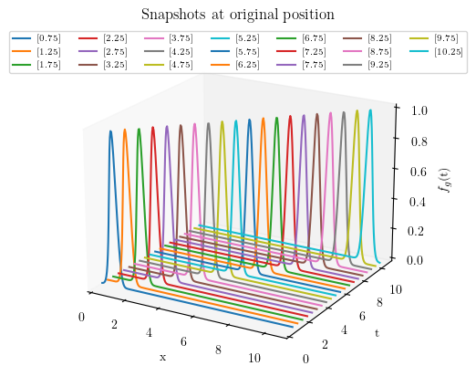
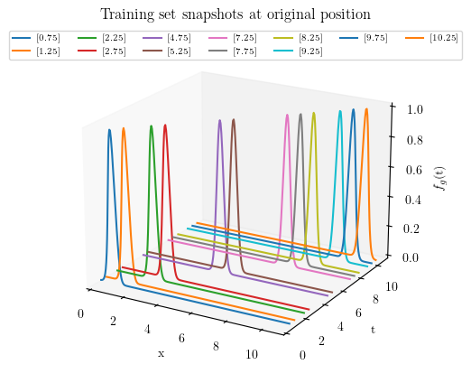
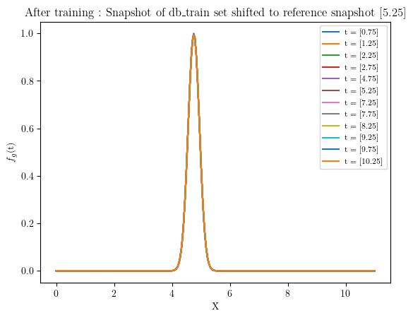
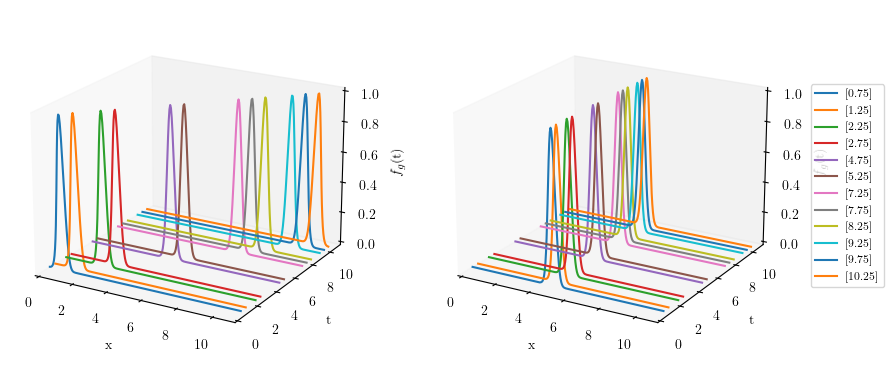
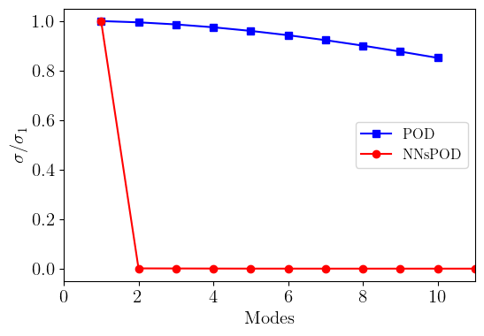
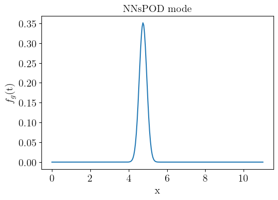
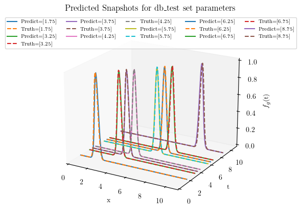

Using Plugin for implementing NNsPOD-ROM
========================================

In this tutorial we will explain how to use the **NNsPOD-ROM** algorithm
implemented in **EZyRB** library.

NNsPOD algorithm is purely a data-driven machine learning method that
seeks for an optimal mapping of the various snapshots to a reference
configuration via an automatic detection [1] and seeking for the
low-rank linear approximation subspace of the solution manifold. The
nonlinear transformation of the manifold leads to an accelerated KnW
decay, resulting in a low-dimensional linear approximation subspace, and
enabling the construction of efficient and accurate reduced order
models. The complete workflow of the NNsPOD-ROM algorithm, comprising of
both the offline and online phases is presented in [2].

References:

[1] Papapicco, D., Demo, N., Girfoglio, M., Stabile, G., & Rozza,
G.(2022). The Neural Network shifted-proper orthogonal decomposition: A
machine learning approach for non-linear reduction of hyperbolic
equations.Computer Methods in Applied Mechanics and Engineering, 392,
114687 - https://doi.org/10.1016/j.cma.2022.114687

[2] Gowrachari, H., Demo, N., Stabile, G., & Rozza, G. (2024).
Non-intrusive model reduction of advection-dominated hyperbolic problems
using neural network shift augmented manifold transformations. arXiv
preprint - https://arxiv.org/abs/2407.18419.

Problem defintion
~~~~~~~~~~~~~~~~~

We consider **1D gaussian distribution functions**, in wihch :math:`x`
is random variable, $ :raw-latex:`\mu `$ is mean and $
:raw-latex:`\sigma`^2 $ is variance, where $ :raw-latex:`\sigma `$ is
the standard deviation or the width of gaussian.

.. math::

   f(x)=\frac{1}{\sigma \sqrt{2 \pi}} e^{-(x-\mu)^2 /\left(2 \sigma^2\right)}

To mimic travelling waves, here we parameterize the mean :math:`\mu`
values, where changing :math:`\mu` shifts the distribution along x-axis,

Initial setting
~~~~~~~~~~~~~~~

First of all import the required packages: We need the standard Numpy,
Torch, Matplotlib, and some classes from EZyRB.

-  ``numpy:`` to handle arrays and matrices we will be working with.
-  ``torch:`` to enable the usage of Neural Networks
-  ``matplotlib:`` to handle the plotting environment.

From ``EZyRB`` we need: 1. The ``ROM`` class, which performs the model
order reduction process. 2. A module such as ``Database``, where the
matrices of snapshots and parameters are stored. 3. A dimensionality
reduction method such as Proper Orthogonal Decomposition ``POD`` 4. An
interpolation method to obtain an approximation for the parametric
solution for a new set of parameters such as the Radial Basis Function
``RBF``, or Multidimensional Linear Interpolator ``Linear``.

.. code:: ipython3

    import numpy as np
    import torch
    from scipy import spatial
    from matplotlib import pyplot as plt
    
    from ezyrb import POD, RBF, Database, Snapshot, Parameter, Linear, ANN
    from ezyrb import ReducedOrderModel as ROM
    from ezyrb.plugin import AutomaticShiftSnapshots

.. code:: ipython3

    def gaussian(x, mu, sig):
        return np.exp(-np.power(x - mu, 2.) / (2 * np.power(sig, 2.)))
    
    def wave(t, res=256):
        x = np.linspace(0, 11, res)
        return x, gaussian(x, t, 0.2).T   # parameterizing mean value

Offline phase
-------------

In this case, we obtain 15 snapshots from the analytical model.

.. code:: ipython3

    n_params = 20
    params = np.linspace(0.75, 10.25, n_params).reshape(-1, 1)
    
    pod = POD(rank=1)  
    rbf = RBF()
    db = Database()
    
    for param in params:
        space, values = wave(param)
        snap = Snapshot(values=values.T, space=space)
        db.add(Parameter(param), snap)
        
    print("Snapshot shape : ", db.snapshots_matrix.shape)
    print("Parameter shape : ", db.parameters_matrix.shape)

.. parsed-literal::

    Snapshot shape :  (20, 256)
    Parameter shape :  (20, 1)

.. code:: ipython3

    db_train, db_test = db.split([0.7,0.3])
    print("Lenght of training data set:", len(db_train))
    print(f"Parameters of training set: \n {db_train.parameters_matrix.flatten()}")
    
    print("Lenght of test data set:", len(db_test))
    print(f"Parameters of testing set: \n {db_test.parameters_matrix.flatten()}")

.. parsed-literal::

    Lenght of training data set: 12
    Parameters of training set: 
     [ 0.75  1.25  2.25  2.75  4.75  5.25  7.25  7.75  8.25  9.25  9.75 10.25]
    Lenght of test data set: 8
    Parameters of testing set: 
     [1.75 3.25 3.75 4.25 5.75 6.25 6.75 8.75]

.. code:: ipython3

    plt.rcParams.update({
        "text.usetex": True,
        "font.family": "serif",
        "font.serif": ["Times New Roman"],
    })
    
    fig1 = plt.figure(figsize=(5,5))
    ax = fig1.add_subplot(111,projection='3d')
    
    for param in params:
        space, values = wave(param)
        snap = Snapshot(values=values.T, space=space)
        ax.plot(space, param*np.ones(space.shape), values, label = f"{param}")
    ax.set_xlabel('x')
    ax.set_ylabel('t')
    ax.set_zlabel('$f_{g}$(t)')
    ax.set_xlim(0,11)
    ax.set_ylim(0,11)
    ax.set_zlim(0,1)
    ax.legend(loc="upper center", ncol=7, prop = { "size": 7})
    ax.grid(False)
    ax.view_init(elev=20, azim=-60, roll=0)
    ax.set_title("Snapshots at original position")
    plt.show()

.. code:: ipython3

    #%% 3D PLOT : db_train snpashots at original position
    fig2 = plt.figure(figsize=(5,5))
    ax = fig2.add_subplot(111, projection='3d')
    
    for i in range(len(db_train)):
        ax.plot(space,(db_train.parameters_matrix[i]*np.ones(space.shape)), db_train.snapshots_matrix[i], label = db_train.parameters_matrix[i])
    ax.set_xlabel('x')
    ax.set_ylabel('t')
    ax.set_zlabel('$f_{g}$(t)')
    ax.set_xlim(0,11)
    ax.set_ylim(0,11)
    ax.set_zlim(0,1)
    ax.legend(loc="upper center", ncol=7, prop = { "size": 7})
    ax.grid(False)
    ax.view_init(elev=20, azim=-60, roll=0)
    ax.set_title("Training set snapshots at original position")
    plt.show()

``InterpNet:`` must learn the reference configuration in the best
possible way w.r.t its grid point distribution such that it will be able
to reconstruct field values for every shifted centroid disrtribution.

``ShiftNet:`` will learn the shift operator for a given problem, which
quantifies the optimal-shift, resulting in shifted space that transports
all the snapshots to the reference frame.

``Training:`` The training of ShiftNet and InterpNet are seperated with
the latter being trained first. Once the network has learned the
best-possible reconstruct of the solution field of the reference
configuration, its forward map will be used for the training of Shiftnet
as well, in a cascaded fashion. For this reason, we must optimise the
loss of interpnet considerably more than ShiftNet’s.

.. code:: ipython3

    torch.manual_seed(1)
    
    interp = ANN([10,10], torch.nn.Softplus(), [1e-6, 200000], frequency_print=1000, lr=0.03)
    shift  = ANN([], torch.nn.LeakyReLU(), [1e-4, 10000], optimizer=torch.optim.Adam, frequency_print=500, l2_regularization=0,  lr=0.0023)
    
    rom = ROM(
        database=db_train, 
        reduction=pod, 
        approximation=rbf, 
        plugins=[
            AutomaticShiftSnapshots(
                    shift_network= shift,
                    interp_network=interp,
                    interpolator=Linear(fill_value=0), 
                    reference_index=4, 
                    parameter_index=4,
                    barycenter_loss=20.)
                ]
            )
    rom.fit()

.. parsed-literal::

    [epoch      1]	9.325559e-02
    [epoch   1000]	1.529361e-03
    [epoch   2000]	4.970222e-04
    [epoch   3000]	4.387998e-04
    [epoch   4000]	4.628130e-04
    [epoch   5000]	3.835012e-04
    [epoch   6000]	3.140604e-04
    [epoch   7000]	3.919086e-04
    [epoch   8000]	4.268886e-04
    [epoch   9000]	9.304365e-05
    [epoch  10000]	4.048840e-04
    [epoch  11000]	3.448661e-04
    [epoch  12000]	1.810824e-04
    [epoch  13000]	1.608639e-04
    [epoch  14000]	1.410103e-04
    [epoch  15000]	1.369342e-04
    [epoch  16000]	3.215274e-04
    [epoch  17000]	1.686200e-05
    [epoch  18000]	1.850619e-04
    [epoch  19000]	5.792178e-05
    [epoch  20000]	1.031569e-05
    [epoch  21000]	5.006416e-04
    [epoch  22000]	7.024280e-06
    [epoch  23000]	3.728175e-06
    [epoch  24000]	2.684203e-06
    [epoch  25000]	2.088043e-05
    [epoch  26000]	2.364460e-05
    [epoch  27000]	5.422693e-05
    [epoch  28000]	8.736612e-06
    [epoch  29000]	1.406125e-03
    [epoch  29941]	9.978612e-07
    [epoch      1]	1.996005e+01
    [epoch    500]	3.647174e+00
    [epoch   1000]	2.648998e+00
    [epoch   1500]	1.878768e+00
    [epoch   2000]	1.296257e+00
    [epoch   2500]	8.012146e-01
    [epoch   3000]	3.615186e-01
    [epoch   3500]	8.892784e-03
    [epoch   4000]	4.733771e-03
    [epoch   4500]	2.296455e-03
    [epoch   5000]	9.881203e-04
    [epoch   5500]	3.655896e-04
    [epoch   6000]	1.145256e-04
    [epoch   6055]	9.997654e-05

.. parsed-literal::

    <ezyrb.reducedordermodel.ReducedOrderModel at 0x7f70089f4a90>

.. code:: ipython3

    #%% Snapshots shifted reference position after training
    for i in range(len(db_train.parameters_matrix)):
        plt.plot(space, rom.shifted_database.snapshots_matrix[i], label = f"t = {db_train.parameters_matrix[i]}") #rom._shifted_reference_database.parameters_matrix
        plt.legend(prop={'size': 8})
        plt.ylabel('$f_{g}$(t)') 
        plt.xlabel('X')
        plt.title(f'After training : Snapshot of db_train set shifted to reference snapshot {db_train.parameters_matrix[5]}')
    plt.show()

Showing the snapshots before (left) and after pre-processing (right) of
solution manifold

.. code:: ipython3

    fig3 = plt.figure(figsize=(10, 5))
    
    # First subplot
    ax1 = fig3.add_subplot(121, projection='3d')
    for i in range(len(db_train)):
        ax1.plot(space, (db_train.parameters_matrix[i] * np.ones(space.shape)), db_train.snapshots_matrix[i])
    ax1.set_xlabel('x')
    ax1.set_ylabel('t')
    ax1.set_zlabel('$f_{g}$(t)')
    ax1.set_xlim(0,11)
    ax1.set_ylim(0,11)
    ax1.set_zlim(0,1)
    ax1.grid(False)
    ax1.view_init(elev=20, azim=-60, roll=0)
    
    # Second subplot
    ax2 = fig3.add_subplot(122, projection='3d')
    for i in range(len(rom.shifted_database)):
        ax2.plot(space, (rom.shifted_database.parameters_matrix[i] * np.ones(space.shape)), 
                 rom.shifted_database.snapshots_matrix[i], label=rom.shifted_database.parameters_matrix[i])
    ax2.set_xlabel('x')
    ax2.set_ylabel('t')
    ax2.set_zlabel('$f_{g}$(t)')
    ax2.set_xlim(0, 11)
    ax2.set_ylim(0, 11)
    ax2.set_zlim(0, 1)
    ax2.grid(False)
    ax2.view_init(elev=20, azim=-60, roll=0)
    handles, labels = ax2.get_legend_handles_labels()
    fig3.legend(handles, labels, loc='center right', ncol=1, prop={'size': 8})
    plt.show()

.. code:: ipython3

    #%% Singular values of original snapshots and shifted snapshots
    U, s = np.linalg.svd(db.snapshots_matrix.T, full_matrices=False)[:2]
    N_modes = np.linspace(1, len(s),len(s))
    
    # Singular values of shifted snapshots 
    U_shifted , s_shifted = np.linalg.svd(rom.shifted_database.snapshots_matrix.T, full_matrices=False)[:2]
    N_modes_shifted = np.linspace(1, len(s_shifted),len(s_shifted))
    
    # Compare singular values
    plt.figure(figsize=(6,4))
    plt.plot(N_modes[:10], s[:10]/np.max(s),"-s",color = "blue", label='POD')
    plt.plot(N_modes_shifted, s_shifted/np.max(s_shifted),"-o", color = "red", label='NNsPOD')
    plt.ylabel('$\sigma/\sigma_{1}$', size=15) 
    plt.xlabel('Modes', size=15)
    plt.xlim(0, 11)
    plt.legend(fontsize=12)
    plt.xticks(fontsize=15)
    plt.yticks(fontsize=15)
    plt.show()

.. code:: ipython3

    #%% POD MODES 
    modes = pod.modes
    plt.figure(figsize=(6,4))
    plt.plot(space, modes*-1)
    plt.ylabel('$f_{g}$(t)', size=15) 
    plt.xlabel('x', size=15)
    plt.title('NNsPOD mode', size=15)
    plt.xticks(fontsize=15)
    plt.yticks(fontsize=15)
    plt.show()

Online phase
------------

.. code:: ipython3

    #%% Test set predictions using NNsPOD
    pred = rom.predict(db_test.parameters_matrix) # Calculate predicted solution for given mu
    
    fig5 = plt.figure(figsize=(5,5))
    ax = fig5.add_subplot(111, projection='3d')
    for i in range(len(pred)):
        space, orig = wave(db_test.parameters_matrix[i])
        ax.plot(space,(db_test.parameters_matrix[i]*np.ones(space.shape)), pred.snapshots_matrix[i], label = f'Predict={db_test.parameters_matrix[i]}')
        ax.plot(space,(db_test.parameters_matrix[i]*np.ones(space.shape)), orig, '--', label = f'Truth={db_test.parameters_matrix[i]}')
    ax.set_xlabel('x')
    ax.set_ylabel('t')
    ax.set_zlabel('$f_{g}$(t)')
    ax.set_xlim(0,11)
    ax.set_ylim(0,11)
    ax.set_zlim(0,1)
    ax.legend(loc="upper center", ncol=5, prop = { "size": 7})
    ax.grid(False)
    ax.view_init(elev=20, azim=-60, roll=0)
    ax.set_title('Predicted Snapshots for db_test set parameters')
    plt.show()

.. code:: ipython3

    #%% Reconstruction and prediction error
    train_err = rom.test_error(db_train)
    test_err = rom.test_error(db_test)
    
    print('Mean Train error: ', train_err)
    print('Mean Test error: ', test_err)

.. parsed-literal::

    Mean Train error:  0.18585298603714098
    Mean Test error:  0.11119321870633797

