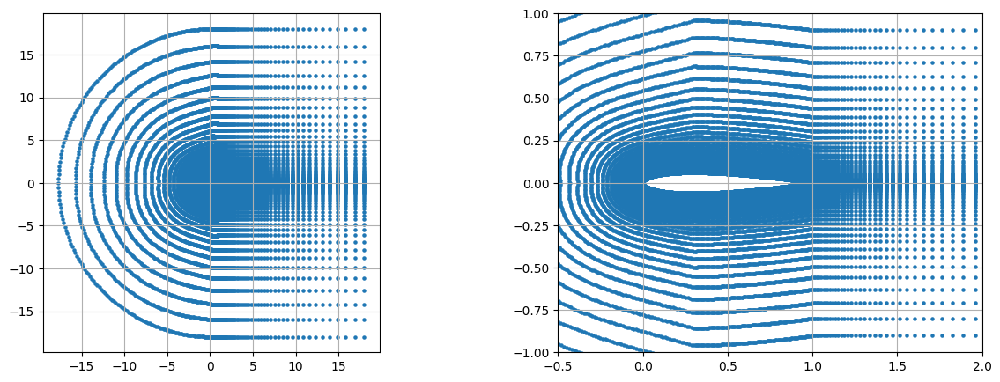
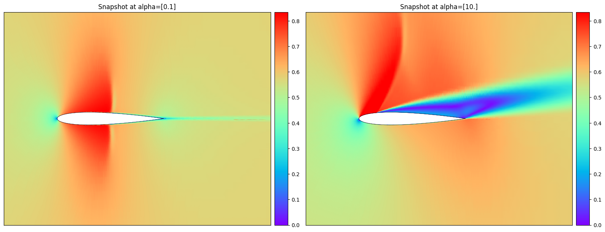
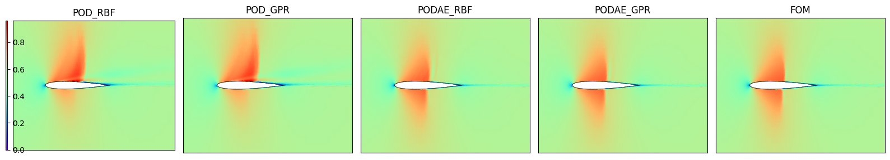
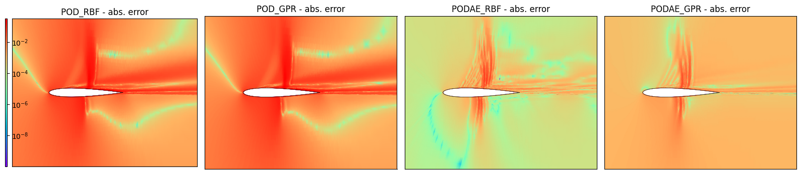
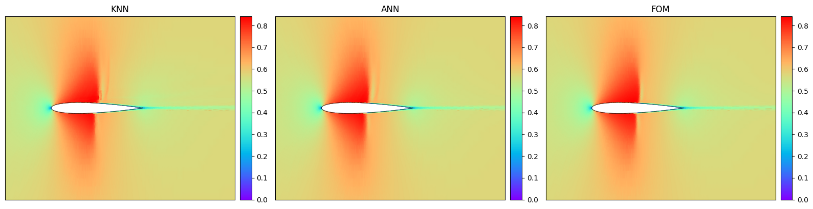
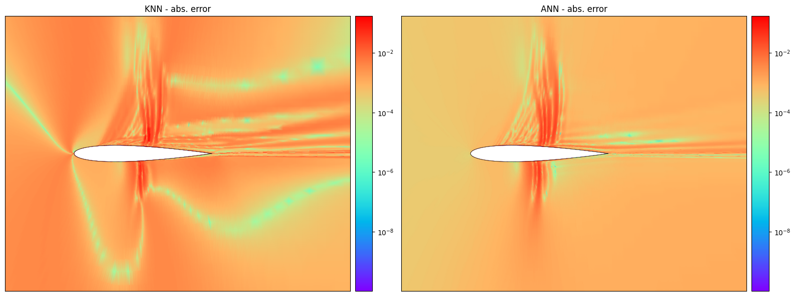
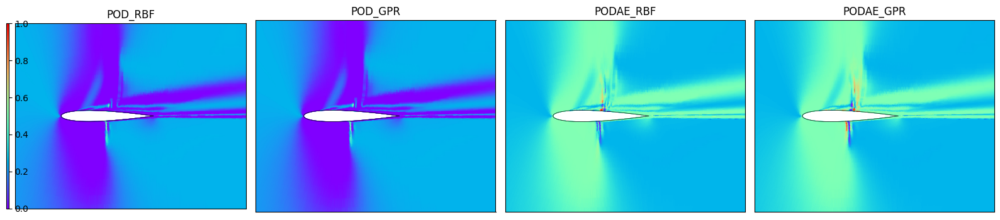
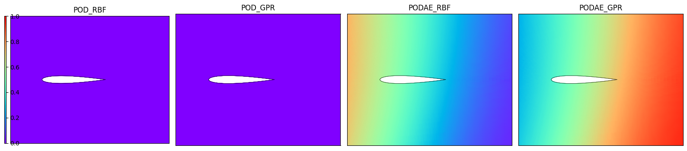

Build a Multi Reduced Order Model (MultiROM)
============================================

In this tutorial, we will show how to aggregate the predictions of
different ROMs following the method presented in the `paper by Ivagnes
et
al. <https://link.springer.com/content/pdf/10.1007/s00707-024-04007-9.pdf>`__

Let’s call :math:`\boldsymbol{\eta}=(\boldsymbol{x}, \boldsymbol{\mu})`
the problem’s features, namely the space coordinates and the parameters.

The idea is to build and combine a set of ROMs
:math:`\{\mathcal{M}_1, \mathcal{M}_2, \dots, \mathcal{M}_{N}\}`, to
approximate a specific high-fidelity field, for instance the
parametrized velocity :math:`\boldsymbol{u}(\boldsymbol{\eta})`. The
individual ROMs differ in the reduction approach and/or in the
approximation technique. The **MultiROM prediction** will then be a
convex combination of the predictions of the pre-trained individual
ROMs. If the :math:`i`-th ROM prediction is
:math:`\tilde{\boldsymbol{u}}^{(i)}(\boldsymbol{\eta})`, then the
MultiROM prediction will be:

.. math:: \tilde{\boldsymbol{u}}(\boldsymbol{\eta}) = \sum_{i=1}^{N} w^{(i)}(\boldsymbol{\eta}) \tilde{\boldsymbol{u}}^{(i)}(\boldsymbol{\eta}) ,

where the weights associated with each ROM in the convex combination are
space- and parameter-dependent. In this way, the **MultiROM** should
effectively and automatically identify the ROM with the optimal
performance across various regions of the spatial and parameter domains.

To build the model, we have to design a method to compute the weights,
also in unseen settings. We here consider a dataset from the library
**Smithers** (``NavierStokesDataset``), and we divide it into three
subsets: - the **training** dataset (composed of
:math:`M_{\text{train}}` instances): used to train the individual ROMs;
- the **evaluation** dataset (composed of :math:`M_{\text{evaluation}}`
instances): used to compute the optimal weights; - the **test** dataset
(composed of :math:`M_{\text{test}}` instances): used to test our
methodology, where the weights are approximated with a regression
technique.

Now the question is: *How to compute the weights?* We here consider two
different approaches: - **XMA** (as in `de Zordo-Banliat et
al. <https://www.sciencedirect.com/science/article/abs/pii/S0021999123007234>`__),
where the weights are computed in the evaluation set, using the
following expression:

.. math::

   w^{(i)}(\boldsymbol{\eta})=\dfrac{g^{(i)}(\boldsymbol{\eta})}{\sum_{i=1}^N g^{(i)}(\boldsymbol{\eta})}, \, g^{(i)}(\boldsymbol{\eta})=\text{exp}\left( - \dfrac{1}{2} \dfrac{(\tilde{\boldsymbol{u}}^{(i)}(\boldsymbol{\eta}) - \boldsymbol{u}(\boldsymbol{\eta}))^2}{\sigma^2} \right),\, \text{for } \boldsymbol{\eta}=\boldsymbol{\eta}_{\text{evaluation}}.
     

\ In the test set, a regression approach (``KNN``) is used to
approximate the weights at unseen
:math:`\boldsymbol{\eta}=\boldsymbol{\eta}_{\text{test}}`.

-  **ANN**: a neural network takes as input :math:`\boldsymbol{\eta}`,
   and gives as output directly the weights
   :math:`w^{(i)}, i=1, \dots, N,` of the convex combination. It is
   trained to minimize the following loss:

   .. math:: \mathcal{L}=\frac{1}{M_{\textrm{test}}} \sum_{j=1}^{M_{\textrm{test}}}\left(\sum_{i=1}^N \left(w^{(i)}(\boldsymbol{\eta}_j) \tilde{\boldsymbol{u}}^{(i)}(\boldsymbol{\eta}_j)\right) - \boldsymbol{u}(\boldsymbol{\eta}_j) \right)^2

Let’s begin the tutorial with some useful imports.

.. code:: ipython3

    import numpy as np
    import copy
    %pip install -e ../
    from ezyrb import Database
    from ezyrb import POD, AE, PODAE
    from ezyrb import RBF, GPR, ANN, KNeighborsRegressor
    from ezyrb import ReducedOrderModel as ROM
    from ezyrb import MultiReducedOrderModel as MultiROM
    from ezyrb.plugin import Aggregation, DatabaseSplitter
    import matplotlib.pyplot as plt
    import torch
    import torch.nn as nn
    from matplotlib.colors import LogNorm
    import matplotlib.tri as tri
    import matplotlib
    from mpl_toolkits.axes_grid1 import make_axes_locatable

.. parsed-literal::

    Obtaining file:///Users/aivagnes/Desktop/Work/Packages/EZyRB
      Preparing metadata (setup.py) ... [?25ldone
    [?25hRequirement already satisfied: future in /Library/Frameworks/Python.framework/Versions/3.8/lib/python3.8/site-packages (from ezyrb==1.3.0) (0.18.3)
    Requirement already satisfied: numpy in /Library/Frameworks/Python.framework/Versions/3.8/lib/python3.8/site-packages (from ezyrb==1.3.0) (1.24.4)
    Requirement already satisfied: scipy in /Library/Frameworks/Python.framework/Versions/3.8/lib/python3.8/site-packages (from ezyrb==1.3.0) (1.10.1)
    Requirement already satisfied: matplotlib in /Library/Frameworks/Python.framework/Versions/3.8/lib/python3.8/site-packages (from ezyrb==1.3.0) (3.7.1)
    Requirement already satisfied: scikit-learn>=1.0 in /Library/Frameworks/Python.framework/Versions/3.8/lib/python3.8/site-packages (from ezyrb==1.3.0) (1.3.2)
    Requirement already satisfied: torch in /Library/Frameworks/Python.framework/Versions/3.8/lib/python3.8/site-packages (from ezyrb==1.3.0) (2.0.1)
    Requirement already satisfied: joblib>=1.1.1 in /Library/Frameworks/Python.framework/Versions/3.8/lib/python3.8/site-packages (from scikit-learn>=1.0->ezyrb==1.3.0) (1.2.0)
    Requirement already satisfied: threadpoolctl>=2.0.0 in /Library/Frameworks/Python.framework/Versions/3.8/lib/python3.8/site-packages (from scikit-learn>=1.0->ezyrb==1.3.0) (3.1.0)
    Requirement already satisfied: contourpy>=1.0.1 in /Library/Frameworks/Python.framework/Versions/3.8/lib/python3.8/site-packages (from matplotlib->ezyrb==1.3.0) (1.0.7)
    Requirement already satisfied: cycler>=0.10 in /Library/Frameworks/Python.framework/Versions/3.8/lib/python3.8/site-packages (from matplotlib->ezyrb==1.3.0) (0.11.0)
    Requirement already satisfied: fonttools>=4.22.0 in /Library/Frameworks/Python.framework/Versions/3.8/lib/python3.8/site-packages (from matplotlib->ezyrb==1.3.0) (4.39.0)
    Requirement already satisfied: kiwisolver>=1.0.1 in /Library/Frameworks/Python.framework/Versions/3.8/lib/python3.8/site-packages (from matplotlib->ezyrb==1.3.0) (1.4.4)
    Requirement already satisfied: packaging>=20.0 in /Library/Frameworks/Python.framework/Versions/3.8/lib/python3.8/site-packages (from matplotlib->ezyrb==1.3.0) (23.0)
    Requirement already satisfied: pillow>=6.2.0 in /Library/Frameworks/Python.framework/Versions/3.8/lib/python3.8/site-packages (from matplotlib->ezyrb==1.3.0) (9.4.0)
    Requirement already satisfied: pyparsing>=2.3.1 in /Library/Frameworks/Python.framework/Versions/3.8/lib/python3.8/site-packages (from matplotlib->ezyrb==1.3.0) (3.0.9)
    Requirement already satisfied: python-dateutil>=2.7 in /Library/Frameworks/Python.framework/Versions/3.8/lib/python3.8/site-packages (from matplotlib->ezyrb==1.3.0) (2.8.2)
    Requirement already satisfied: importlib-resources>=3.2.0 in /Library/Frameworks/Python.framework/Versions/3.8/lib/python3.8/site-packages (from matplotlib->ezyrb==1.3.0) (5.12.0)
    Requirement already satisfied: filelock in /Library/Frameworks/Python.framework/Versions/3.8/lib/python3.8/site-packages (from torch->ezyrb==1.3.0) (3.15.4)
    Requirement already satisfied: typing-extensions in /Library/Frameworks/Python.framework/Versions/3.8/lib/python3.8/site-packages (from torch->ezyrb==1.3.0) (4.11.0)
    Requirement already satisfied: sympy in /Library/Frameworks/Python.framework/Versions/3.8/lib/python3.8/site-packages (from torch->ezyrb==1.3.0) (1.11.1)
    Requirement already satisfied: networkx in /Library/Frameworks/Python.framework/Versions/3.8/lib/python3.8/site-packages (from torch->ezyrb==1.3.0) (3.1)
    Requirement already satisfied: jinja2 in /Library/Frameworks/Python.framework/Versions/3.8/lib/python3.8/site-packages (from torch->ezyrb==1.3.0) (3.1.2)
    Requirement already satisfied: zipp>=3.1.0 in /Library/Frameworks/Python.framework/Versions/3.8/lib/python3.8/site-packages (from importlib-resources>=3.2.0->matplotlib->ezyrb==1.3.0) (3.15.0)
    Requirement already satisfied: six>=1.5 in /Library/Frameworks/Python.framework/Versions/3.8/lib/python3.8/site-packages (from python-dateutil>=2.7->matplotlib->ezyrb==1.3.0) (1.16.0)
    Requirement already satisfied: MarkupSafe>=2.0 in /Library/Frameworks/Python.framework/Versions/3.8/lib/python3.8/site-packages (from jinja2->torch->ezyrb==1.3.0) (2.1.2)
    Requirement already satisfied: mpmath>=0.19 in /Library/Frameworks/Python.framework/Versions/3.8/lib/python3.8/site-packages (from sympy->torch->ezyrb==1.3.0) (1.3.0)
    Installing collected packages: ezyrb
      Attempting uninstall: ezyrb
        Found existing installation: ezyrb 1.3.0
        Uninstalling ezyrb-1.3.0:
          Successfully uninstalled ezyrb-1.3.0
      Running setup.py develop for ezyrb
    Successfully installed ezyrb-1.3.0
    
    [notice] A new release of pip is available: 24.1.1 -> 25.0.1
    [notice] To update, run: pip install --upgrade pip
    Note: you may need to restart the kernel to use updated packages.

Before starting with the core part of the tutorial, we define a useful
function for plotting the solutions on a 2D mesh.

.. code:: ipython3

    def plot_multiple_internal(db, fields_list, titles_list, figsize=None,
                               logscale=False, lim_x=(-0.5, 2), lim_y=(-1, 1),
                               different_cbar=True, clims=None):
        '''
        Plot multiple internal fields in one figure.
    
        Parameters
        ----------
        db : PinaDataModule
            The data module.
        fields_list : list
            The list of fields to plot.
        titles_list : list
            The list of titles for each field.
        figsize : tuple (optional, default=(16, 16/len(fields_list))
            The size of the figure.
        logscale : bool (optional, default=False)
            Whether to use a logarithmic color scale.
        lim_x : tuple (optional, default=(-0.5, 2))
            The x-axis limits.
        lim_y : tuple (optional, default=(-1, 1))
            The y-axis limits.
        different_cbar : bool (optional, default=True)
            Whether to use a different colorbar for each field.
    
        Returns
        ----------
        None (shows figures)
        '''
        triang = db.auxiliary_triang
        
        if figsize is None:
            figsize = (16, 16/len(fields_list))
        fig, axs = plt.subplots(1, len(fields_list), figsize=figsize)
        for e, a in enumerate(axs):
            field = fields_list[e]
            title = titles_list[e]
            if clims is None:
                clims = fields_list[0].min(), fields_list[0].max()
            if logscale:
                lognorm = matplotlib.colors.LogNorm(vmin=clims[0]+1e-12,
                    vmax=clims[1])
                c = a.tripcolor(triang, field, cmap='rainbow',
                    shading='gouraud', norm=lognorm)
            else:
                c = a.tripcolor(triang, field, cmap='rainbow',
                    shading='gouraud', vmin=clims[0],
                    vmax=clims[1])
            a.plot(db._coords_airfoil()[0], db._coords_airfoil()[1],
                color='black', lw=0.5)
            a.plot(db._coords_airfoil(which='neg')[0],
                db._coords_airfoil(which='neg')[1],
                color='black', lw=0.5)
            a.set_aspect('equal')
            if lim_x is not None:
                a.set_xlim(lim_x)
            if lim_y is not None:
                a.set_ylim(lim_y)
            if title is not None:
                a.set_title(title)
            if different_cbar:
                divider = make_axes_locatable(a)
                cax = divider.append_axes("right", size= "5%", pad=0.1)
                plt.colorbar(c, cax=cax)
            a.set_xticks([])
            a.set_yticks([])
        if not different_cbar:
            divider = make_axes_locatable(axs[0])
            cax = divider.append_axes("left", size= "1%", pad=0.1)
            plt.colorbar(c, cax=cax)
        plt.tight_layout()
        plt.show()

Now, we define a simple neural network class, which will be useful in
the multiROM-ANN case. This networks takes as input the spatial
coordinates and the problem parameters, and gives as output the weights
of our multiROM. This class is inherited from the ``ANN`` one, with a
newly defined ``fit`` function. In this case, in the loss function we
have the discrepancy between the multiROM prediction and the FOM
reference. Moreover, the power of this technique is that it is
continuous in space, so we can train the NN on a reduced amount of
spatial data, gaining time also in the training itself.

.. code:: ipython3

    class ANN_weights(ANN):
        def __init__(self, mrom, layers, function, stop_training, loss=None,
                     optimizer=torch.optim.Adam, lr=0.001, l2_regularization=0,
                     frequency_print=500, last_identity=True):
            super().__init__(layers, function, stop_training, loss=None,
                     optimizer=torch.optim.Adam, lr=0.001, l2_regularization=0,
                     frequency_print=10, last_identity=True)
    
            # import useful data from multirom and roms predictions
            self.mrom = mrom
            self.params = list(self.mrom.roms.values())[0].validation_full_database.parameters_matrix
            
            self.frequency_print = frequency_print
            self.lr = lr
            self.l2_regularization = l2_regularization
    
            # import ROMs and validation predictions of all ROMs
            self.rom_validation_predictions = {}
            for rom in self.mrom.roms:
                rom_pred = self.mrom.roms[rom]
                rom_pred = rom_pred.predict(self.params)
                rom_pred = rom_pred.reshape(rom_pred.shape[0]*rom_pred.shape[1], 1)
                self.rom_validation_predictions[rom] = self._convert_numpy_to_torch(rom_pred)
                
            # Device configuration
            self.device = torch.device('mps' if torch.backends.mps.is_available() else 'cpu')
            print(f"Using device: 💻 {self.device}")
            
        def _build_model_(self, points):
            layers = self.layers.copy()
            layers.insert(0, points.shape[1])
            layers.append(len(self.mrom.roms))
            self.model = self._list_to_sequential(layers, self.function)
            
            # Move the model to the device
            self.model.to(self.device)
    
        def fit(self, points, values): # points=(x, mu) and values=(snapshots)
            self._build_model_(points)
            optimizer = self.optimizer(
                self.model.parameters(),
                lr=self.lr, weight_decay=self.l2_regularization)
            
            #scheduler = torch.optim.lr_scheduler.ReduceLROnPlateau(optimizer, mode='min', factor=0.9, patience=1000)
    
            points = self._convert_numpy_to_torch(points)
            values = self._convert_numpy_to_torch(values)
            
            # Move everything to the device
            points = points.to(self.device)
            values = values.to(self.device)
            self.rom_validation_predictions = {rom: pred.to(self.device) for rom, pred in self.rom_validation_predictions.items()}
    
            # train the neural network
            n_epoch = 1
            flag = True
            while flag:
                # compute output of ANN
                y_pred = self.model(points)
    
                # compute aggregated solution from output weights of ANN
                aggr_pred = torch.zeros(values.shape, device=self.device)
                for i, rom in enumerate(self.mrom.roms):
                    weight = y_pred.clone()[..., i].unsqueeze(-1)
                    aggr_pred += weight*self.rom_validation_predictions[rom]
    
                # difference between aggregated solution and exact solution
                loss = self.loss(aggr_pred, values)
    
                optimizer.zero_grad()
                loss.backward()
                optimizer.step()
    
                scalar_loss = loss.item()
                self.loss_trend.append(scalar_loss)
                
                #scheduler.step(scalar_loss)
    
                for criteria in self.stop_training:
                    if isinstance(criteria, int):  # stop criteria is an integer
                        if n_epoch == criteria:
                            flag = False
                    elif isinstance(criteria, float):  # stop criteria is float
                        if scalar_loss < criteria:
                            flag = False
    
                if (flag is False or
                        n_epoch == 1 or n_epoch % self.frequency_print == 0):
                    print(f'[epoch {n_epoch:6d}]\t{scalar_loss:e}')
                n_epoch += 1
    
            return optimizer
    
        def predict(self, x):
            
            # Move the model to the device
            x = self._convert_numpy_to_torch(np.array(x))
            x = x.to(self.device)
            y_new = self.model(x)
            ynew = y_new.cpu().detach().numpy()
            return ynew

Now we can introduce the dataset, taken from the library
`Smithers <https://github.com/mathLab/Smithers>`__.

The test case here considered is ``AirfoilTransonicDataset``, namely the
transonic flow over an airfoil (NACA 0012), with the angle of attack
varying in the range [:math:`0^{\circ}`, :math:`10^{\circ}`] at the
Reynolds number :math:`Re=10^7`.

This test case is quite challenging, as it presents shocks, and the
shock position varies a lot from one snapshot to the other. The full
order implementation has been done in OpenFOAM (using a finite volume
discretization) and has been validated with the results in
https://ntrs.nasa.gov/citations/19850019511 and in
https://doi.org/10.2514/1.J051329.

The ``AirfoilTransonicDataset`` is a dictionary including:

-  ``pts_coordinates``: the points’ coordinates, divided into:

   -  ``pts_coordinates['internal']``: x-y coordinates in internal mesh;
   -  ``pts_coordinates['airfoil']``: x-y coordinates on the airfoil;

-  ``params``: the parameters, in our case only the angle of attack;
-  ``snapshots``: the snapshots’ fields, divided into:

   -  ``snapshots['internal']``: the fields evaluated on the 2D internal
      mesh (we will focus on the velocity magnitude ``mag(v)``);
   -  ``snapshots['airfoil']``: the fields on the airfoil (1D fields).

We focus here on the 2D ``mag(v)`` field. Let’s try to read the dataset!

.. code:: ipython3

    from smithers.dataset import NavierStokesDataset, AirfoilTransonicDataset
    data = AirfoilTransonicDataset()
    field = 'mag(v)'
    coords = data.pts_coordinates["internal"].T 
    params = data.params
    snaps = data.snapshots["internal"][field]
    snaps_max = np.max(snaps)
    snaps /= snaps_max
    print("Shape of parameters vector: ", params.shape)
    print("Shape of snapshots matrix: ", snaps.shape)

.. parsed-literal::

    Shape of parameters vector:  (100, 1)
    Shape of snapshots matrix:  (100, 45448)

Let’s try now to visualize the 2D spatial coordinates and the velocity
magnitude snapshots for the two extreme parameters.

.. code:: ipython3

    idx = 0
    # Plot coordinates
    fig, ax = plt.subplots(1, 2, figsize=(15, 5))
    ax[0].scatter(data.pts_coordinates["internal"][0, :],
                data.pts_coordinates["internal"][1, :], s=5)
    ax[1].scatter(data.pts_coordinates["internal"][0, :],
                data.pts_coordinates["internal"][1, :], s=5)
    ax[1].set_xlim(-0.5, 2)
    ax[1].set_ylim(-1, 1)
    
    for a in ax:
      a.grid()
      a.set_aspect("equal")
    plt.show()
    plot_multiple_internal(data, [snaps[0], snaps[-1]], [f"Snapshot at alpha={params[0]}", f"Snapshot at alpha={params[-1]}"],
                          figsize=None, logscale=False, lim_x=(-0.5, 2), lim_y=(-1, 1), different_cbar=True)

Then, we can create the database for the ROMs and initialize the
reduction and approximation approaches. Here, we decide to consider POD
and PODAE as reduction techniques, RBF and GPR as approximation
strategies. In the end, we are considering four ROMs: POD-RBF, POD-GPR,
PODAE-RBF, PODAE-GPR.

.. code:: ipython3

    # Create the database
    db_all = Database(params, snaps, coords)
    
    # Define some reduction and approximation methods to test
    rank = 3
    pod_for_podae = POD('svd', rank=80)
    ae_for_podae = AE([30, 10, rank], [rank, 10, 30], nn.Softplus(), nn.Softplus(), 50000, lr=1e-3, frequency_print=2000)
    reduction_methods = {
        'POD': POD('svd', rank=rank),
        'PODAE': PODAE(pod_for_podae, ae_for_podae)
    }
    approximation_methods = {
        'RBF': RBF(),
        'GPR': GPR()
    }

We now define the ROMs (store into a simple dictionary). Note that we
use the ``DatabaseSplitter`` plugin to split our database into train,
validation, test, and predict sets. Here we will only use the train,
validation, and predict sets.

.. code:: ipython3

    # Define a dictionary to store the ROMs
    roms_dict = {}
    db_splitter_plugin = DatabaseSplitter(train=0.6, validation=0.3, test=0.,
                                                predict=0.1, seed=42)
    # Train a ROM for each combination of reduction and approximation
    for redname, redclass in reduction_methods.items():
        for approxname, approxclass in approximation_methods.items():
            rom = ROM(copy.deepcopy(db_all),
                      copy.deepcopy(redclass),
                      copy.deepcopy(approxclass),
                      plugins=[db_splitter_plugin])
            roms_dict[f'{redname}_{approxname}'] = rom

Then, the definition of the ``MultiROM`` follows. We can now fit the
MultiROM, which coincides with fitting the individual ROMs separately.

.. code:: ipython3

    # Build a simple multiROM without aggregation and save it
    multirom_noagg = MultiROM(roms_dict)
    # Fit the multiROM (this step may take some time)
    multirom_noagg.fit()

.. parsed-literal::

    [epoch      1]	2.469141e+02
    [epoch   2000]	1.377898e-01
    [epoch   4000]	1.071991e-01
    [epoch   6000]	7.265408e-02
    [epoch   8000]	4.396581e-02
    [epoch  10000]	3.937927e-02
    [epoch  12000]	3.674430e-02
    [epoch  14000]	4.076399e-02
    [epoch  16000]	2.940542e-02
    [epoch  18000]	2.764397e-02
    [epoch  20000]	2.988867e-02
    [epoch  22000]	2.159446e-02
    [epoch  24000]	2.006776e-02
    [epoch  26000]	1.967250e-02
    [epoch  28000]	1.194988e-02
    [epoch  30000]	9.829493e-03
    [epoch  32000]	9.823296e-03
    [epoch  34000]	8.634089e-03
    [epoch  36000]	8.533438e-03
    [epoch  38000]	8.409876e-03
    [epoch  40000]	1.002743e-02
    [epoch  42000]	1.035028e-02
    [epoch  44000]	8.028184e-03
    [epoch  46000]	8.383193e-03
    [epoch  48000]	7.963227e-03
    [epoch  50000]	1.061061e-02
    [epoch      1]	2.433394e+02
    [epoch   2000]	2.430486e-01
    [epoch   4000]	8.800354e-02
    [epoch   6000]	6.279282e-02
    [epoch   8000]	4.753726e-02
    [epoch  10000]	4.444053e-02
    [epoch  12000]	4.448576e-02
    [epoch  14000]	4.391388e-02
    [epoch  16000]	4.341885e-02
    [epoch  18000]	3.927369e-02
    [epoch  20000]	3.098299e-02
    [epoch  22000]	2.612145e-02
    [epoch  24000]	2.182353e-02
    [epoch  26000]	2.140819e-02
    [epoch  28000]	2.090856e-02
    [epoch  30000]	2.038679e-02
    [epoch  32000]	1.961394e-02
    [epoch  34000]	1.646917e-02
    [epoch  36000]	1.557970e-02
    [epoch  38000]	1.507105e-02
    [epoch  40000]	1.453493e-02
    [epoch  42000]	1.511188e-02
    [epoch  44000]	1.419082e-02
    [epoch  46000]	1.334900e-02
    [epoch  48000]	1.282931e-02
    [epoch  50000]	1.201333e-02

.. parsed-literal::

    <ezyrb.reducedordermodel.MultiReducedOrderModel at 0x30cc6edc0>

After fitting the individual models in the train database, we can now
read the validation and test databases, and, for example, visualize the
ROM predictions for some test parameters.

.. code:: ipython3

    # Get the dictionary of ROMs
    roms_dict = multirom_noagg.roms
    
    # Extract one ROM from the dictionary, and read the validation and test databases
    rom_one = list(multirom_noagg.roms.values())[0]
    db_validation = rom_one.validation_full_database
    db_test = rom_one.predict_full_database

.. code:: ipython3

    # Visualize the results of each ROM in the multiROM without aggregation on
    # a new parameter
    j = 0 # we choose an index to plot the solution and the weights
    p = db_test.parameters_matrix[j]
    print("Test parameter for plotting: ", p)
    fields = []
    roms_pred = [rom.predict([p]).flatten() for rom in roms_dict.values()]
    roms_pred.append(db_test.snapshots_matrix[j])
    errs = [np.abs(r - db_test.snapshots_matrix[j])+1e-10 for r in roms_pred[:-1]]
    labels = [f'{key}' for key in roms_dict.keys()]
    labels.append("FOM")
    plot_multiple_internal(data, roms_pred, labels, different_cbar=False)
    plot_multiple_internal(data, errs, [f"{l} - abs. error" for l in labels], logscale=True, different_cbar=False)

.. parsed-literal::

    Test parameter for plotting:  [0.2]

We can see that the ``POD_*`` solutions are more overdiffusive, while
the ``PODAE_*`` solutions better capture the discontinuity, even if they
still exhibit imprecisions.

We now initialize two novel ``multiROM``\ s using the plugin
``Aggregation``. One model is for the standard XMA aggregation
(indicated with ``fit_function=None``) and uses ``KNN`` as regressor.
The other model uses the ``ANN_weights`` class to compute the weights
starting from the individual ROM prediction. In both cases, the weights
are trained in the validation set.

.. code:: ipython3

    print("Fitting multiROM with KNN aggregation...")
    knn = KNeighborsRegressor()
    multirom_KNN = MultiROM(roms_dict, plugins=[Aggregation(fit_function=None, predict_function=knn), db_splitter_plugin])
    multirom_KNN.fit()

.. parsed-literal::

    Fitting multiROM with KNN aggregation...
    Optimal sigma value in weights:  [0.009994]

.. parsed-literal::

    <ezyrb.reducedordermodel.MultiReducedOrderModel at 0x30fd2f310>

.. code:: ipython3

    print("Fitting multiROM with ANN aggregation...")
    ann = ANN_weights(multirom_noagg, [64, 64, 64],[nn.Softplus(), nn.Softplus(), nn.Softplus(), nn.Softmax(dim=-1)],
                        stop_training=1000, lr=1e-3, frequency_print=100, l2_regularization=0)
    multirom_ANN = MultiROM(roms_dict, plugins=[Aggregation(fit_function=ann), db_splitter_plugin])
    multirom_ANN.fit()

.. parsed-literal::

    Fitting multiROM with ANN aggregation...
    Using device: 💻 mps
    [epoch      1]	1.110127e-04
    [epoch    100]	2.332629e-05
    [epoch    200]	2.292044e-05
    [epoch    300]	2.286620e-05
    [epoch    400]	2.281346e-05
    [epoch    500]	2.274650e-05
    [epoch    600]	2.265942e-05
    [epoch    700]	2.256762e-05
    [epoch    800]	2.250623e-05
    [epoch    900]	2.247204e-05
    [epoch   1000]	2.244576e-05

.. parsed-literal::

    <ezyrb.reducedordermodel.MultiReducedOrderModel at 0x30fd2f7c0>

Let’s now quantify the relative error on test parameters for the
individual ROMs and for the multiROM strategies.

.. code:: ipython3

    multiroms = {}
    multiroms["KNN"] = multirom_KNN
    multiroms["ANN"] = multirom_ANN
    
    header = '{:10s}'.format('')
    for name in approximation_methods:
        header += ' {:>16s}'.format(name)
    print(header)
    for redname, redclass in reduction_methods.items():
        row = '{:10s}'.format(redname)
        for approxname, approxclass in approximation_methods.items():
            rom = roms_dict[redname+'_'+approxname]
            row += ' {:16e}'.format(rom.test_error(db_test))
        print(row)
        print('-'*len(row))
    for model_name in multiroms:
        row = '{:10s}'.format(model_name)
        multirom_ = multiroms[model_name]
        row += '- MultiROM {:16e}'.format(multirom_.test_error(db_test))
        print(row)

.. parsed-literal::

                            RBF              GPR
    POD            5.263353e-02     5.263348e-02
    --------------------------------------------
    PODAE          9.785834e-03     9.695809e-03
    --------------------------------------------
    KNN       - MultiROM     1.304681e-02
    ANN       - MultiROM     9.233725e-03

We can try now to visualize the predicted multiROMs solutions for a test
parameters, and the errors with respect to the corresponding FOM
reference. The multiROM automatically detects the best method in
different spatial coordinates.

.. code:: ipython3

    fields = []
    roms_pred = []
    for rom in multiroms.values():
        roms_pred.append(rom.predict(np.array([p]).reshape(-1, 1)).flatten())
    roms_pred.append(db_test.snapshots_matrix[j].flatten())
    errs = [np.abs(r - db_test.snapshots_matrix[j])+1e-10 for r in roms_pred[:-1]]
    labels = list(multiroms.keys())
    labels.append("FOM")
    # visualize fields
    plot_multiple_internal(data, roms_pred, labels,
                figsize=None, logscale=False, lim_x=(-0.5, 2), lim_y=(-1, 1))
    # visualize errors in log scale
    plot_multiple_internal(data, errs, [f"{l} - abs. error" for l in labels],
                figsize=None, logscale=True, lim_x=(-0.5, 2), lim_y=(-1, 1))

We finally try to visualize the weights, for example for the standard
XMA multiROM strategy, for the same test parameter as before.

.. code:: ipython3

    for mrom in multiroms.values():
        weights_list = []
        for rom in roms_dict.keys():
            weights_list.append(mrom.weights_predict[rom].flatten())
        plot_multiple_internal(data, weights_list, list(roms_dict.keys()),
            figsize=None, logscale=False, lim_x=(-0.5, 2), lim_y=(-1, 1), different_cbar=False, clims=[0, 1])

We can immediately see that the standard aggregation algorithm is
“activating” the nonlinear reduction approaches (PODAE) in the spatial
regions close to the shock and to the wake, while in the rest part of
the domain the weights are 50% for POD methods and 50% for PODAE
methods. The ANN strategy instead converges to weights with less
space-dependency. This highly depends on the architecture of the ANN,
and on all the hyperparameters (activation function, learning rate,
weight decay).

What’s next?
~~~~~~~~~~~~

There’s still a lot to do like: - improving the training of the ANN by
adding a negative loss contribution depending on the spatial variability
of the weights. In this way we try to enforce more space variability; -
try to combine FOM and ROM together (multifidelity aggregation).

